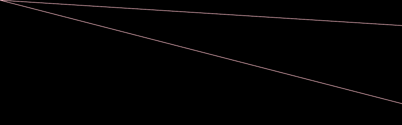

# PHP|ImagickDraw pathCurveToQuadaticBezierSmoothRelative()函数

> Original: [https://www.geeksforgeeks.org/php-imagickdraw-pathcurvetoquadraticbeziersmoothrelative-function/](https://www.geeksforgeeks.org/php-imagickdraw-pathcurvetoquadraticbeziersmoothrelative-function/)

**ImagickDraw：：pathCurveToQuadraticBezierSmoothRelative()函数**是 php 中的一个内置函数，用于绘制从当前点到(x，y)的二次贝塞尔曲线(使用相对坐标)。

**语法：**

```
*bool* ImagickDraw::pathCurveToQuadraticBezierSmoothRelative( *float* $x, *float* $y )
```

**参数：**此函数接受上述两个参数，如下所述：

*   **$x：**它指定结束的 x 坐标。
*   **$y：**它指定结束 y 坐标。

**返回值：**如果成功，此函数返回 TRUE。

**异常：**此函数在出错时引发 ImagickException。

下面给出的程序说明了 php 中的**ImagickDraw：：pathCurveToQuadraticBezierSmoothRelative()函数**：

**程序 1：**

```
<?php

// Create a new imagick object
$imagick = new Imagick();

// Create a image on imagick object
$imagick->newImage(800, 250, 'black');

// Create a new ImagickDraw object
$draw = new ImagickDraw();

$draw->setFillColor('black');

// Set the stroke color
$draw->setStrokeColor('brown');

// Draw curves to Quadratic Bezier Smooth Relative (without pathClose())
$draw->pathStart();
$draw->pathCurveToQuadraticBezierSmoothRelative(950, 250);
$draw->pathFinish();

// Render the draw commands
$imagick->drawImage($draw);

// Show the output
$imagick->setImageFormat('png');
header("Content-Type: image/png");
echo $imagick->getImageBlob();
?>
```

**输出：**


**程序 2：**

```
<?php
// Create a new imagick object
$imagick = new Imagick();

// Create a image on imagick object
$imagick->newImage(800, 250, 'black');

// Create a new ImagickDraw object
$draw = new ImagickDraw();

$draw->setFillColor('black');

// Set the stroke color
$draw->setStrokeColor('pink');

// Draw curves to Quadratic Bezier Smooth Relative (with pathClose())
$draw->pathStart();
$draw->pathCurveToQuadraticBezierSmoothRelative(3950, 250);
$draw->pathCurveToQuadraticBezierSmoothRelative(950, 250);
$draw->pathCurveToQuadraticBezierSmoothRelative(-2000, 250);
$draw->pathClose();
$draw->pathFinish();

// Render the draw commands
$imagick->drawImage($draw);

// Show the output
$imagick->setImageFormat('png');
header("Content-Type: image/png");
echo $imagick->getImageBlob();
?>
```

**输出：**


**引用：**[https://www.php.net/manual/en/imagickdraw.pathcurvetoquadraticbeziersmoothrelative.php](https://www.php.net/manual/en/imagickdraw.pathcurvetoquadraticbeziersmoothrelative.php)