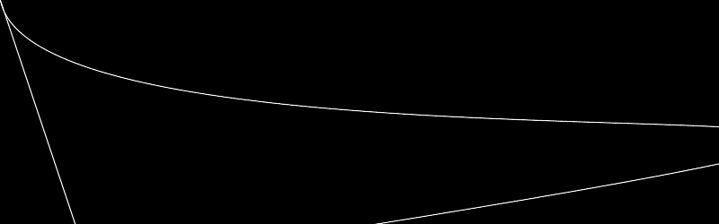

# PHP|ImagickDraw pathCurveToRelative()函数

> Original: [https://www.geeksforgeeks.org/php-imagickdraw-pathcurvetorelative-function/](https://www.geeksforgeeks.org/php-imagickdraw-pathcurvetorelative-function/)

**ImagickDraw：：pathCurveToRelative()函数**是 PHP 中的一个内置函数，用于使用(x1，y1)作为曲线起点的控制点，使用相对坐标(x2，y2)作为曲线终点的控制点，绘制一条从当前点到(x，y)的三次贝塞尔曲线。

**语法：**

```php
*bool* ImagickDraw::pathCurveToRelative( 
*float* $x1, *float* $y1, *float* 
$x2, *float* $y2, *float* $x, *float* $y )
```

**参数：**此函数接受上述 6 个参数，如下所述：

*   **$x1：**指定起点控制点的 x 坐标。
*   **$y1：**指定起点控制点的 y 坐标。
*   **$x2：**指定终点控制点的 x 坐标。
*   **$y2：**指定终点控制点的 y 坐标。
*   **$x：**它指定结束的 x 坐标。
*   **$y：**它指定结束的 y 坐标。

**返回值：**如果成功，此函数返回 TRUE。

**异常：**此函数在出错时引发 ImagickException。

下面给出的程序演示了 PHP 中的**ImagickDraw：：pathCurveToRelative()函数**：

**程序 1：**

```php
<?php

// Create a new imagick object
$imagick = new Imagick();

// Create a image on imagick object
$imagick->newImage(800, 250, 'black');

// Create a new ImagickDraw object
$draw = new ImagickDraw();

$draw->setFillColor('black');

// Set the stroke color
$draw->setStrokeColor('white');

// Draw curves to Quadratic Bezier Relative (without pathClose())
$draw->pathStart();
$draw->pathCurveToRelative(50, 250, 900, 20, 100, 300);
$draw->pathFinish();

// Render the draw commands
$imagick->drawImage($draw);

// Show the output
$imagick->setImageFormat('png');
header("Content-Type: image/png");
echo $imagick->getImageBlob();
?>
```

**输出：**


**程序 2：**

```php
<?php

// Create a new imagick object
$imagick = new Imagick();

// Create a image on imagick object
$imagick->newImage(800, 250, 'black');

// Create a new ImagickDraw object
$draw = new ImagickDraw();

$draw->setFillColor('black');

// Set the stroke color
$draw->setStrokeColor('white');

// Draw curves to Quadratic Bezier Relative (with pathClose())
$draw->pathStart();
$draw->pathCurveToRelative(50, 250, 1900, 20, 100, 300);
$draw->pathClose();
$draw->pathFinish();

// Render the draw commands
$imagick->drawImage($draw);

// Show the output
$imagick->setImageFormat('png');
header("Content-Type: image/png");
echo $imagick->getImageBlob();
?>
```

**输出：**


**引用：**[https://www.php.net/manual/en/imagickdraw.pathcurvetorelative.php](https://www.php.net/manual/en/imagickdraw.pathcurvetorelative.php)