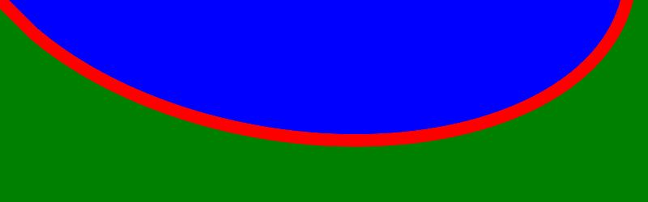
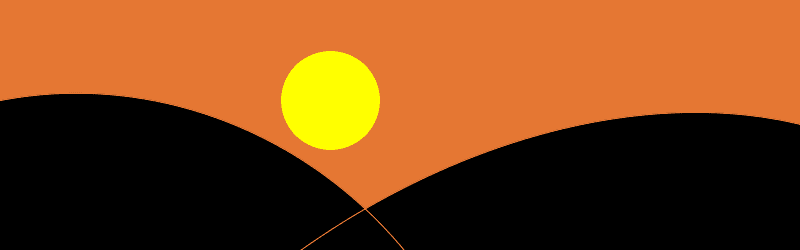

# PHP|ImagickDraw 路径 EllipticArcAbsolute()函数

> Original: [https://www.geeksforgeeks.org/php-imagickdraw-pathellipticarcabsolute-function/](https://www.geeksforgeeks.org/php-imagickdraw-pathellipticarcabsolute-function/)

**ImagickDraw：：pathEllipticArcAbsolute()函数**是 PHP 中的一个内置函数，用于使用绝对坐标绘制从当前点到(x，y)的椭圆弧。

**语法：**

```php
*bool* ImagickDraw::pathEllipticArcAbsolute(
*float* $rx, *float* $ry, *float* $x_axis_rotation, 
*bool* $large_arc_flag, *bool* $sweep_flag, *float* $x, 
*float* $y )
```

**参数：**此函数接受上述 7 个参数，如下所述：

*   **$rx：**它指定 x 半径。
*   **$ry：**它指定 y 半径
*   **$x_AXIS_ROTATION：**它指定 x 轴旋转
*   **$LARGE_ARC_FLAG：**它指定是否绘制较大的可用圆弧。
*   **$Sweep_flag：**它指定是否绘制与时钟方向旋转匹配的圆弧。
*   **$x：**它指定 x 坐标。
*   **$y：**它指定 y 坐标。

**返回值：**如果成功，此函数返回 TRUE。

**异常：**此函数在出错时引发 ImagickException。

下面给出的程序演示了 PHP 中的**ImagickDraw：：pathEllipticArcAbsolute()函数**：

**程序 1：**

```php
<?php

// Create a new imagick object
$imagick = new Imagick();

// Create a image on imagick object
$imagick->newImage(800, 250, 'green');

// Create a new ImagickDraw object
$draw = new ImagickDraw();

$draw->setFillColor('blue');

// Set the stroke color
$draw->setStrokeColor('red');

// Set the stroke width
$draw->setStrokeWidth(15);

// Draw elliptic arc
$draw->pathStart();
$draw->pathEllipticArcAbsolute(420, 250, 10, true, true, 40, 40);
$draw->pathClose();
$draw->pathFinish();

// Render the draw commands
$imagick->drawImage($draw);

// Show the output
$imagick->setImageFormat('png');
header("Content-Type: image/png");
echo $imagick->getImageBlob();
?>
```

**输出：**


**程序 2：**

```php
<?php

// Create a new imagick object
$imagick = new Imagick();

// Create a image on imagick object
$imagick->newImage(800, 250, '#E57733');

// Create a new ImagickDraw object
$draw = new ImagickDraw();

// Set the width of stroke
$draw->setStrokeWidth(1);

// Set the color of stroke
$draw->setStrokeColor('#E57733');

// Set the fill color
$draw->setFillColor('black');

// Set the fill rule
$draw->setFillRule(Imagick::FILLRULE_NONZERO);

// Draw a sunset cartoon
$draw->pathStart();
$draw->pathMoveToAbsolute(0, 100);
$draw->pathEllipticArcAbsolute(420, 400, 410, true, true, 0, 900);
$draw->pathMoveToAbsolute(300, 250);
$draw->pathEllipticArcAbsolute(420, 600, 410, true, true, 0, 900);
$draw->pathClose();
$draw->pathFinish();
$draw->setFillColor('yellow');
$draw->translate(30, 0);
$draw->circle(300, 100, 300, 150);

// Render the draw commands
$imagick->drawImage($draw);

// Show the output
$imagick->setImageFormat('png');
header("Content-Type: image/png");
echo $imagick->getImageBlob();
?>
```

**输出：**


**引用：**[https://www.php.net/manual/en/imagickdraw.pathellipticarcabsolute.php](https://www.php.net/manual/en/imagickdraw.pathellipticarcabsolute.php)