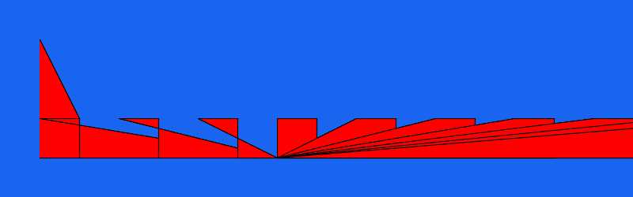

# PHP|ImagickDraw pathFinish()函数

> Original: [https://www.geeksforgeeks.org/php-imagickdraw-pathfinish-function/](https://www.geeksforgeeks.org/php-imagickdraw-pathfinish-function/)

**ImagickDraw：：pathFinish()函数**是 PHP 中的内置函数，用于终止当前路径。 当要在图像中绘制多个路径时，这是必需的。

**语法：**

```php
*bool* ImagickDraw::pathFinish( *void* )
```

**参数：**此函数不接受任何参数。

**返回值：**如果成功，此函数返回 TRUE。

**异常：**此函数在出错时引发 ImagickException。

下面的程序演示了 PHP 中的**ImagickDraw：：pathFinish()函数**：

**程序 1：**

```php
<?php

// Create a new imagick object
$imagick = new Imagick();

// Create a image on imagick object
$imagick->newImage(800, 250, '#1a65f0');

// Create a new ImagickDraw object
$draw = new ImagickDraw();

$draw->setFillColor('#2fceeb');

// Set the stroke color
$draw->setStrokeColor('black');

// Set the stroke width
$draw->setStrokeWidth(15);

// Create a path
$draw->pathStart();
$draw->pathMoveToAbsolute(50, 50);
$draw->pathLineToAbsolute(100, 50);
$draw->pathLineToRelative(0, 50);
$draw->pathLineToHorizontalRelative(-50);
$draw->pathFinish();

// Create another path
$draw->pathStart();
$draw->pathMoveToAbsolute(50, 50);
$draw->pathMoveToRelative(300, 0);
$draw->pathLineToRelative(50, 0);
$draw->pathLineToVerticalRelative(50);
$draw->pathLineToHorizontalAbsolute(350);
$draw->pathclose();
$draw->pathFinish();

// Render the draw commands
$imagick->drawImage($draw);

// Show the output
$imagick->setImageFormat('png');
header("Content-Type: image/png");
echo $imagick->getImageBlob();
?>
```

**输出：**


**程序 2：**

```php
<?php

// Create a new imagick object
$imagick = new Imagick();

// Create a image on imagick object
$imagick->newImage(800, 250, '#1a65f0');

// Create a new ImagickDraw object
$draw = new ImagickDraw();

$draw->setFillColor('red');

// Set the stroke color
$draw->setStrokeColor('black');

// Set the stroke width
$draw->setStrokeWidth(1);

// Create a path
$draw->pathStart();
$draw->pathMoveToAbsolute(50, 50);
$draw->pathLineToAbsolute(100, 150);
$draw->pathLineToRelative(0, 50);
$draw->pathLineToHorizontalRelative(-50);
$draw->pathFinish();

$x = 0;
for ($x; $x < 10; $x++) {

    // Create another path
    $draw->pathStart();
    $draw->pathMoveToAbsolute(50, 150);
    $draw->pathMoveToRelative($x * 100, 0);
    $draw->pathLineToRelative(50, 0);
    $draw->pathLineToVerticalRelative(50);
    $draw->pathLineToHorizontalAbsolute(350);
    $draw->pathclose();
    $draw->pathFinish();
}

// Render the draw commands
$imagick->drawImage($draw);

// Show the output
$imagick->setImageFormat('png');
header("Content-Type: image/png");
echo $imagick->getImageBlob();
?>
```

**输出：**


**引用：**[https://www.php.net/manual/en/imagickdraw.pathfinish.php](https://www.php.net/manual/en/imagickdraw.pathfinish.php)