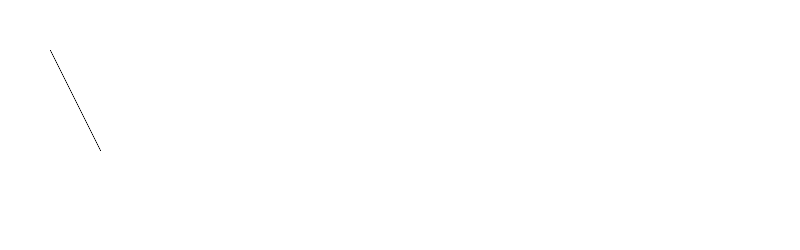

# PHP|ImagickDraw pathLineToAbsolute()函数

> Original: [https://www.geeksforgeeks.org/php-imagickdraw-pathlinetoabsolute-function/](https://www.geeksforgeeks.org/php-imagickdraw-pathlinetoabsolute-function/)

**ImagickDraw：：pathLineToAbsolute()函数**是 PHP 中的一个内置函数，用于使用绝对坐标绘制从当前点到给定坐标的直线路径。 然后，该坐标将成为新的当前点。 初始点可以使用*pathMoveToAbsolute()*函数设置。

**语法：**

```
*bool* ImagickDraw::pathLineToAbsolute( *float* $x, *float* $y )
```

**参数：**此函数接受上述两个参数，如下所述：

*   **$x：**它指定起始 x 坐标。
*   **$y：**它指定起始 y 坐标。

**返回值：**如果成功，此函数返回 TRUE。

下面的程序演示了 PHP 中的**ImagickDraw：：pathLineToAbsolute()函数**：

**程序 1：**

```
<?php

// Create a new imagick object
$imagick = new Imagick();

// Create a image on imagick object
$imagick->newImage(800, 250, 'white');

// Create a new ImagickDraw object
$draw = new ImagickDraw();

// Set the fill color
$draw->setFillColor('black');

// Create a path
$draw->pathStart();

// Use 50, 50 as start point
$draw->pathMoveToAbsolute(50, 50);

// Use 100, 150 as end point
$draw->pathLineToAbsolute(100, 150);

// End the path
$draw->pathFinish();

// Render the draw commands
$imagick->drawImage($draw);

// Show the output
$imagick->setImageFormat('png');
header("Content-Type: image/png");
echo $imagick->getImageBlob();
?>
```

**输出：**


**程序 2：**

```
<?php

// Create a new imagick object
$imagick = new Imagick();

// Create a image on imagick object
$imagick->newImage(800, 250, 'white');

// Create a new ImagickDraw object
$draw = new ImagickDraw();

// Set the fill color
$draw->setFillColor('black');

// Create a path
$draw->pathStart();

// Draw a triangle
// First corner
$draw->pathMoveToAbsolute(350, 50);

// Second corner
$draw->pathLineToAbsolute(250, 150);

// Third corner
$draw->pathLineToAbsolute(350, 150);

// End the path
$draw->pathFinish();

// Render the draw commands
$imagick->drawImage($draw);

// Show the output
$imagick->setImageFormat('png');
header("Content-Type: image/png");
echo $imagick->getImageBlob();
?>
```

**输出：**


**引用：**[https://www.php.net/manual/en/imagickdraw.pathlinetoabsolute.php](https://www.php.net/manual/en/imagickdraw.pathlinetoabsolute.php)