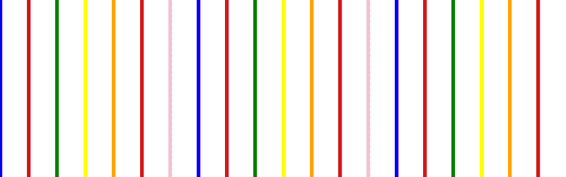

# PHP|ImagickDraw pathLineToVerticalRelative()函数

> Original: [https://www.geeksforgeeks.org/php-imagickdraw-pathlinetoverticalrelative-function/](https://www.geeksforgeeks.org/php-imagickdraw-pathlinetoverticalrelative-function/)

**ImagickDraw：：pathLineToVerticalRelative()函数**是 PHP 中的一个内置函数，用于使用相对坐标绘制从当前点到目标点的垂直线路径。 然后，目标点将成为新的当前点。

**语法：**

```
*bool* ImagickDraw::pathLineToVerticalRelative( *float* $y )
```

**参数：**此函数接受保存 y 坐标的单个参数**$y**。

**返回值：**如果成功，此函数返回 TRUE。

**异常：**此函数在出错时引发 ImagickException。

下面给出的程序演示了 PHP 中的**ImagickDraw：：pathLineToVerticalRelative()函数**：

**程序 1：**

```
<?php

// Create a new imagick object
$imagick = new Imagick();

// Create a image on imagick object
$imagick->newImage(800, 250, 'white');

// Create a new ImagickDraw object
$draw = new ImagickDraw();

// Set the stroke color
$draw->setStrokeColor('blue');

// Set the stroke width
$draw->setStrokeWidth(5);

// Draw line using pathLineToVerticalRelative
$draw->pathStart();
$draw->pathMoveToRelative(400, 0);
$draw->pathLineToVerticalRelative(1000);
$draw->pathFinish();

// Render the draw commands
$imagick->drawImage($draw);

// Show the output
$imagick->setImageFormat('png');
header("Content-Type: image/png");
echo $imagick->getImageBlob();
?>
```

**输出：**


**程序 2：**

```
<?php

// Create a new imagick object
$imagick = new Imagick();

// Create a image on imagick object
$imagick->newImage(800, 250, 'white');

// Create a new ImagickDraw object
$draw = new ImagickDraw();

$color = ['blue', 'red', 'green',
      'yellow', 'orange', 'brown', 'pink'];

// Set the stroke width
$draw->setStrokeWidth(5);

// Draw lines
for ($x = 0; $x < 20; $x++) {
    $draw->setStrokeColor($color[$x % 7]);
    $draw->pathStart();
    $draw->pathMoveToRelative($x * 40, 0);
    $draw->pathLineToVerticalRelative(800);
    $draw->pathFinish();

}

// Render the draw commands
$imagick->drawImage($draw);

// Show the output
$imagick->setImageFormat('png');
header("Content-Type: image/png");
echo $imagick->getImageBlob();
?>
```

**输出：**


**引用：**[https://www.php.net/manual/en/imagickdraw.pathlinetoverticalrelative.php](https://www.php.net/manual/en/imagickdraw.pathlinetoverticalrelative.php)