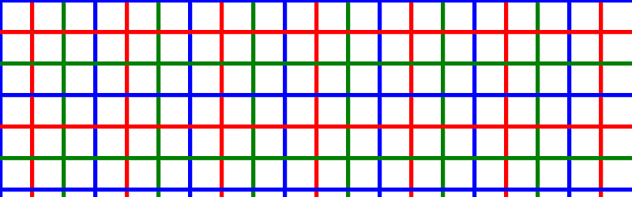

# PHP|ImagickDraw pathMoveToAbsolute()函数

> Original: [https://www.geeksforgeeks.org/php-imagickdraw-pathmovetoabsolute-function/](https://www.geeksforgeeks.org/php-imagickdraw-pathmovetoabsolute-function/)

**ImagickDraw：：pathMoveToAbsolute()函数**是 PHP 中的一个内置函数，用于使用绝对坐标在给定坐标处启动新的子路径。 然后，当前点将成为指定的坐标。 此函数用于在开始绘制任何内容之前设置初始坐标。

**语法：**

```php
*bool* ImagickDraw::pathMoveToAbsolute( *float* $x, *float* $y )
```

**参数：**此函数接受上述两个参数，如下所述：

*   **$x：**它指定 x 坐标。
*   **$y：**它指定 y 坐标。

**返回值：**如果成功，此函数返回 TRUE。

**异常：**此函数在出错时引发 ImagickException。

下面给出的程序说明了 PHP：
**程序 1：**中的**ImagickDraw：：pathMoveToAbsolute()函数**

```php
<?php

// Create a new imagick object
$imagick = new Imagick();

// Create a image on imagick object
$imagick->newImage(800, 250, 'white');

// Create a new ImagickDraw object
$draw = new ImagickDraw();

// Set the stroke width
$draw->setStrokeWidth(30);

$draw->pathStart();

// Setting the stating point to (400, 40)
$draw->pathMoveToAbsolute(400, 40);

// Setting the end point to (500, 40)
$draw->pathLineToHorizontalAbsolute(500);
$draw->pathFinish();

// Render the draw commands
$imagick->drawImage($draw);

// Show the output
$imagick->setImageFormat('png');
header("Content-Type: image/png");
echo $imagick->getImageBlob();
?>
```

**输出：**


**程序 2：**

```php
<?php

// Create a new imagick object
$imagick = new Imagick();

// Create a image on imagick object
$imagick->newImage(800, 250, 'white');

// Create a new ImagickDraw object
$draw = new ImagickDraw();

$color = ['blue', 'red', 'green'];

// Set the stroke width
$draw->setStrokeWidth(5);

// Draw lines
for ($x = 0; $x < 20; $x++) {
    $draw->setStrokeColor($color[$x % 3]);
    $draw->pathStart();
    // Moving to next vertical line
    $draw->pathMoveToAbsolute($x * 40, 0);
    $draw->pathLineToVerticalRelative(800);
    $draw->pathFinish();
}
for ($x = 0; $x < 20; $x++) {
    $draw->setStrokeColor($color[$x % 3]);
    $draw->pathStart();
    // Moving to next horizontal line
    $draw->pathMoveToAbsolute(0, $x * 40);
    $draw->pathLineToHorizontalRelative(800);
    $draw->pathFinish();

}

// Render the draw commands
$imagick->drawImage($draw);

// Show the output
$imagick->setImageFormat('png');
header("Content-Type: image/png");
echo $imagick->getImageBlob();
?>
```

**输出：**


**引用：**[https://www.php.net/manual/en/imagickdraw.pathmovetoabsolute.php](https://www.php.net/manual/en/imagickdraw.pathmovetoabsolute.php)