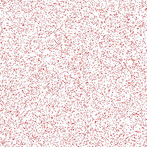

# PHP|ImagickDraw point()函数

> Original: [https://www.geeksforgeeks.org/php-imagickdraw-point-function/](https://www.geeksforgeeks.org/php-imagickdraw-point-function/)

**ImagickDraw：：point()**函数是 PHP 的 Imagick 库中的内置函数，用于绘制点。 此函数使用指定坐标处的当前笔划颜色和笔划粗细。

**语法：**

```
*bool* ImagickDraw::point( $x, $y )
```

**参数：**此函数接受上述两个参数，如下所述：

*   **$x：**此参数用于保存 x 坐标的值。
*   **$y：**此参数用于保存 y 坐标的值。

**返回值：**如果成功，此函数返回 TRUE。

下面的程序说明了 PHP：
**程序：**中的**ImagickDraw：：Point()**函数

```
<?php

// Create an ImagickDraw object
$draw = new \ImagickDraw();

// Set the filled color
$draw->setFillColor('red');

// Use loop to draw 10000 points in given area
for ($x = 0; $x < 10000; $x++) {
    $draw->point(rand(0, 300), rand(0, 300));
}

// Create an Imagick object
$imagick = new \Imagick();

// Set the new image size
$imagick->newImage(300, 300, 'white');

// Set the image format
$imagick->setImageFormat("png");

// Function to draw the image
$imagick->drawImage($draw);

header("Content-Type: image/png");

// Display the output image
echo $imagick->getImageBlob();
?>
```

**输出：**


**引用：**[http://php.net/manual/en/imagickdraw.point.php](http://php.net/manual/en/imagickdraw.point.php)