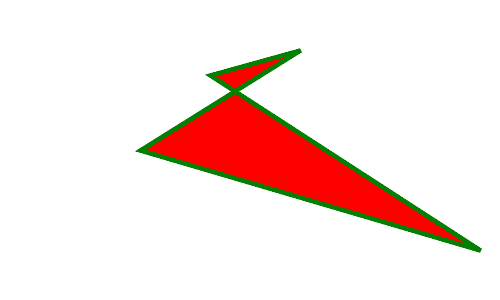

# PHP|ImagickDraw Polygon()函数

> Original: [https://www.geeksforgeeks.org/php-imagickdraw-polygon-function/](https://www.geeksforgeeks.org/php-imagickdraw-polygon-function/)

**ImagickDraw：：Polygon()**函数是 PHP 中 Imagick 库中的内置函数，用于使用指定的坐标数组绘制多边形。

**语法：**

```php
*bool* ImagickDraw::polygon( $coordinates )
```

**参数：**此函数接受数组类型的单个参数*$coels*。 它是用来存放这组点的。
**返回值：**如果成功，此函数返回 TRUE。

下面的程序演示了 PHP 中的**ImagickDraw：：Polygon()函数**：

**程序：**

## PHP

```php
<?php

// require_once('vendor/autoload.php');

// Create an ImagickDraw object
$draw = new \ImagickDraw();

// Set the opacity of image
$draw->setStrokeOpacity(1);

// Set the color of image
$draw->setStrokeColor('Green');

// Set the stroke width
$draw->setStrokeWidth(4);

// Set the fill color
$draw->setFillColor('Red');

// Array contains points
$points = [
    ['x' => 50 * 6, 'y' => 10 * 5],
    ['x' => 20 * 7, 'y' => 30 * 5],
    ['x' => 60 * 8, 'y' => 50 * 5],
    ['x' => 70 * 3, 'y' => 15 * 5],
];

// Draw the polygon with given points
$draw->polygon($points);

// Create an Imagick object
$image = new \Imagick();

// Create an image of given size
$image->newImage(500, 300, 'white');

// Set the image format
$image->setImageFormat("png");

// Draw the image
$image->drawImage($draw);

header("Content-Type: image/png");

// Display the output image
echo $image->getImageBlob();
?>
```

发帖主题：Re：Колибри0.7.8.0



**引用：**[http://php.net/manual/en/imagickdraw.polygon.php](http://php.net/manual/en/imagickdraw.polygon.php)