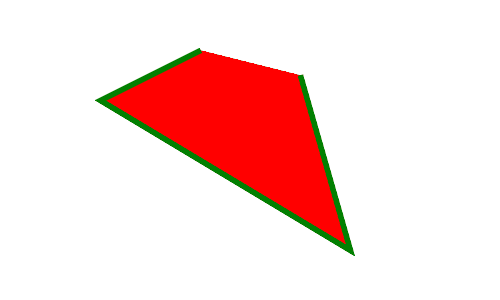

# PHP|ImagickDraw Polyline()函数

> Original: [https://www.geeksforgeeks.org/php-imagickdraw-polyline-function/](https://www.geeksforgeeks.org/php-imagickdraw-polyline-function/)

**ImagickDraw：：Polyline()**函数是 PHP 的 Imagick 库中的内置函数，用于使用指定的坐标数组使用当前笔划、笔划宽度和填充颜色或纹理绘制多段线。

**语法：**

```
*bool* ImagickDraw::polyline( $coordinates )

```

**参数：**此函数接受单个参数*$cotales*，该参数用于将点的坐标保存为数组。

**返回值：**成功时此函数返回 True。

下面的程序说明了 PHP 中的**ImagickDraw：：Polyline()函数**：

**程序 1：**

```
<?php

// Create an ImagickDraw Object
$draw = new ImagickDraw();

// Set Stroke Opacity
$draw->setStrokeOpacity(1);

// Set Stroke Color
$draw->setStrokeColor('green');

// Set Fill Color
$draw->setFillColor('red');

// Set Stroke Width
$draw->setStrokeWidth(5);

// Define the points at which lines to be draw
$points = [
        ['x' => 40 * 5, 'y' => 10 * 5],
        ['x' => 20 * 5, 'y' => 20 * 5],
        ['x' => 70 * 5, 'y' => 50 * 5],
        ['x' => 60 * 5, 'y' => 15 * 5]
    ];

// Call Polyline Function
$draw->polyline($points);

// Create an Imagick Object
$image = new Imagick();

// Create new Image
$image->newImage(500, 300, 'white');

// Set Image Format
$image->setImageFormat("png");

// Draw Image
$image->drawImage($draw);

header("Content-Type: image/png");

// Display the output image
echo $image->getImageBlob();
?>
```

**输出：**


**程序 2：**

```
<?php

// Create an ImagickDraw Object
$draw = new ImagickDraw();

// Set Stroke Opacity
$draw->setStrokeOpacity(1);

// Set Stroke Color
$draw->setStrokeColor('Black');

// Set Fill Color
$draw->setFillColor('Green');

// Set Stroke Width
$draw->setStrokeWidth(3);

// Define the points at which lines to be draw
$points = [
        ['x' => 40 * 5, 'y' => 10 * 5],
        ['x' => 20 * 5, 'y' => 20 * 5],
        ['x' => 70 * 5, 'y' => 50 * 5],
        ['x' => 40 * 5, 'y' => 10 * 5]
    ];

// Set the Font Size 
$draw->setFontSize(50); 

// Set the font family 
$draw->setFontFamily('Ubuntu-Mono'); 

// Set the text to be added 
$draw->annotation(30, 40, "GeeksForGeeks"); 

// Call Polyline Function
$draw->polyline($points);

// Create an Imagick Object
$image = new Imagick();

// Create new Image
$image->newImage(500, 300, 'white');

// Set Image Format
$image->setImageFormat("png");

// Draw Image
$image->drawImage($draw);

header("Content-Type: image/png");

// Display the output image
echo $image->getImageBlob();
?>
```

**输出：**


**引用：**[http://php.net/manual/en/imagickdraw.polyline.php](http://php.net/manual/en/imagickdraw.polyline.php)