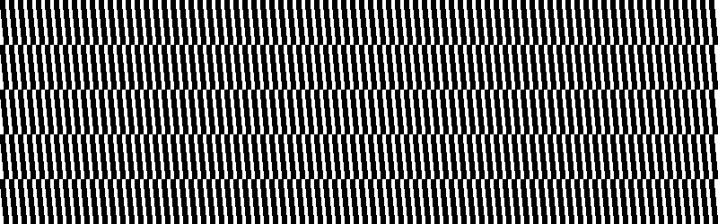
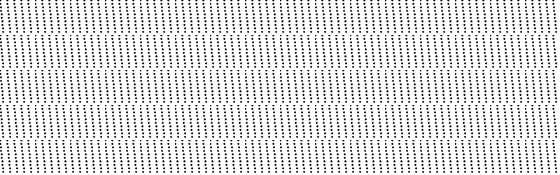

# PHP|ImagickDraw popPattern()函数

> Original: [https://www.geeksforgeeks.org/php-imagickdraw-poppattern-function/](https://www.geeksforgeeks.org/php-imagickdraw-poppattern-function/)

**ImagickDraw：：popPattern()函数**是 PHP 中的一个内置函数，用于终止包含要应用的设计的模式定义。

**语法：**

```
*bool* ImagickDraw::popPattern( *void* )
```

**参数：**此函数不接受任何参数。

**返回值：**如果成功，此函数返回 TRUE。

**异常：**此函数在出错时引发 ImagickException。

下面给出的程序演示了 PHP 中的**ImagickDraw：：popPattern()函数**：

**程序 1：**

```
<?php

// Create a new imagick object
$imagick = new Imagick();

// Create a image on imagick object
$imagick->newImage(800, 250, 'white');

// Create a new imagickDraw object
$draw = new ImagickDraw();

// Push the pattern
$draw->pushPattern("MyPattern", 0, 0, 50, 50);
for ($x = 0; $x < 50; $x += 10) {
    for ($y = 0; $y < 50; $y += 5) {
        $X = $x + (($y / 10) % 10);
        $draw->rectangle($X, $y, $X + 5, $y + 5);
    }
}

// Pop the pattern
$draw->popPattern();

// Set the fill Opacity
$draw->setFillOpacity(0);

// Set the fill pattern URL
$draw->setFillPatternURL('#MyPattern');

// Draw a rectangle
$draw->rectangle(0, 0, 900, 900);

// Render the draw commands
$imagick->drawImage($draw);

// Show the output
$imagick->setImageFormat('png');
header("Content-Type: image/png");
echo $imagick->getImageBlob();
?>
```

**输出：**


**程序 2：**

```
<?php

// Create a new imagick object
$imagick = new Imagick();

// Create a image on imagick object
$imagick->newImage(800, 250, 'white');

// Create a new imagickDraw object
$draw = new ImagickDraw();

// Push the pattern
$draw->pushPattern("MyPattern", 0, 0, 50, 50);
for ($x = 0; $x < 50; $x += 10) {
    for ($y = 0; $y < 50; $y += 5) {
        $X = $x + (($y / 10) % 10);
        $draw->circle($X, $y, $X, $y +1);
    }
}

// Pop the pattern
$draw->popPattern();
// Set the fill Opacity
$draw->setFillOpacity(0);

// Set the fill pattern URL
$draw->setFillPatternURL('#MyPattern');

// Draw a rectangle
$draw->rectangle(0, 0, 900, 900);

// Render the draw commands
$imagick->drawImage($draw);

// Show the output
$imagick->setImageFormat('png');
header("Content-Type: image/png");
echo $imagick->getImageBlob();
?
```

**输出：**


**引用：**[https://www.php.net/manual/en/imagickdraw.poppattern.php](https://www.php.net/manual/en/imagickdraw.poppattern.php)