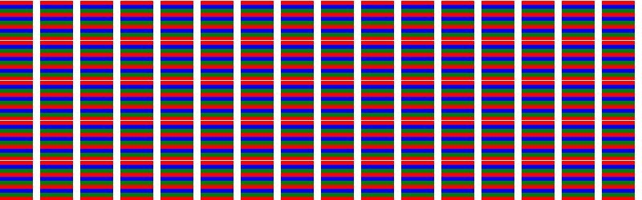

# PHP|ImagickDraw Push Pattern()函数

> Original: [https://www.geeksforgeeks.org/php-imagickdraw-pushpattern-function/](https://www.geeksforgeeks.org/php-imagickdraw-pushpattern-function/)

**ImagickDraw：：ushPattern()函数**是 PHP 中的一个内置函数，用于包含命名模式的定义。 *ush Pattern()*和*popPattern()*之间的所有内容都是 Pattern 的定义。

**语法：**

```php
*bool* ImagickDraw::pushPattern( *string* $pattern_id, 
      *float* $x, *float* $y, *float* $width, *float* $height )
```

**参数：**此函数接受上述五个参数，如下所述：

*   **$pattern_id：**它指定模式的唯一名称
*   **$x：**它指定左上角的 x 坐标。
*   **$y：**它指定左上角的 y 坐标。
*   **$width：**它指定图案的宽度。
*   **$Height：**它指定图案的高度。

**返回值：**如果成功，此函数返回 TRUE。

**异常：**此函数在出错时引发 ImagickException。
下面给出的程序说明了 PHP：
**程序 1：**中的**ImagickDraw：：Push Pattern()函数**

```php
<?php

// Create a new imagick object
$imagick = new Imagick();

// Create a image on imagick object
$imagick->newImage(800, 250, 'white');

// Create a new imagickDraw object
$draw = new ImagickDraw();

// Push the pattern
$draw->pushPattern("MyPattern", 0, 0, 50, 50);
$color = ['red', 'green', 'blue'];
for ($x = 0; $x < 50; $x += 10) {
    for ($y = 0; $y < 50; $y += 5) {
        $draw->setFillColor($color[$y % 3]);
        $draw->rectangle($x % 5, $y + 1, $x, $y + 50);
    }
}
// Pop the pattern
$draw->popPattern();

// Set the fill Opacity
$draw->setFillOpacity(0);

// Set the fill pattern URL
$draw->setFillPatternURL('#MyPattern');

// Draw a rectangle
$draw->rectangle(0, 0, 900, 900);

// Render the draw commands
$imagick->drawImage($draw);

// Show the output
$imagick->setImageFormat('png');
header("Content-Type: image/png");
echo $imagick->getImageBlob();
?>
```

**输出：**


**程序 2：**

```php
<?php

// Create a new imagick object
$imagick = new Imagick();

// Create a image on imagick object
$imagick->newImage(800, 250, 'white');

// Create a new imagickDraw object
$draw = new ImagickDraw();

// Push the pattern
$draw->pushPattern("MyPattern", 0, 0, 50, 50);
$color = ['red', 'green', 'cyan'];
for ($x = 0; $x < 50; $x += 10) {
    for ($y = 0; $y < 50; $y += 5) {
        $draw->setFillColor($color[$y % 3]);
        $draw->circle($x % 2, $y + 100, $x, $y);
    }
}
// Pop the pattern
$draw->popPattern();

// Set the fill Opacity
$draw->setFillOpacity(0);

// Set the fill pattern URL
$draw->setFillPatternURL('#MyPattern');

// Draw a rectangle
$draw->rectangle(0, 0, 900, 900);

// Render the draw commands
$imagick->drawImage($draw);

// Show the output
$imagick->setImageFormat('png');
header("Content-Type: image/png");
echo $imagick->getImageBlob();
?>
```

**输出：**


**引用：**[https://www.php.net/manual/en/imagickdraw.pushpattern.php](https://www.php.net/manual/en/imagickdraw.pushpattern.php)