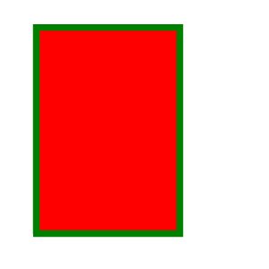

# PHP|ImagickDraw Rectangle()函数

> Original: [https://www.geeksforgeeks.org/php-imagickdraw-rectangle-function/](https://www.geeksforgeeks.org/php-imagickdraw-rectangle-function/)

**ImagickDraw：：Rectangle()**函数是 PHP 的 Imagick 库中的内置函数，用于绘制矩形。

**语法：**

```
*bool* ImagickDraw::rectangle( $x1, $y1, $x2, $y2 )
```

**参数：**此函数接受上述四个参数，如下所述：

*   **$x1：**此参数取左上角的 x 坐标值。
*   **$y1：**此参数取左上角的 y 坐标值。
*   **$x2：**此参数取右下角的 x 坐标值。
*   **$y2：**此参数取右下角的 y 坐标值。

**返回值：**如果成功，此函数返回 TRUE。

以下程序说明 PHP 中的**ImagickDraw Rectangle()函数**：
**程序：**

```
<?php
// require_once('vendor/autoload.php');

// Create ImagickDraw object
$draw = new \ImagickDraw();
$draw->setStrokeColor('Green');
$draw->setFillColor('Red');
$draw->setStrokeWidth(7);
$draw->rectangle(40, 30, 200, 260);

// Create an image object which the draw
// commands can be rendered into
$image = new \Imagick();
$image->newImage(300, 300, 'White');
$image->setImageFormat("png");

// Render the draw commands in the ImagickDraw object 
// into the image.

$image->drawImage($draw);

// Send the image to the browser
header("Content-Type: image/png");
echo $image->getImageBlob();
?>
```

**输出：**

**参考：**[http://php.net/manual/en/imagickdraw.rectangle.php](http://php.net/manual/en/imagickdraw.rectangle.php)