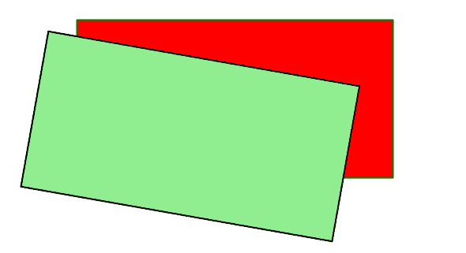
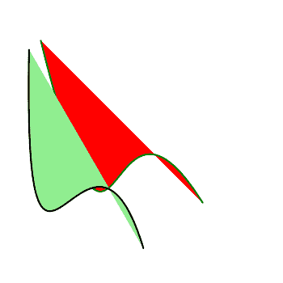

# PHP|ImagickDraw Rotate()函数

> Original: [https://www.geeksforgeeks.org/php-imagickdraw-rotate-function/](https://www.geeksforgeeks.org/php-imagickdraw-rotate-function/)

**ImagickDraw：：Rotate()**函数是 PHP 的内置函数，用于将指定的旋转应用于当前坐标空间。

```
*bool* ImagickDraw::rotate( $degrees )
```

**参数：**此函数接受单个参数*$度*，该参数用于保存旋转度的值。

**返回值：**此函数不返回任何值。

下面的程序说明了 PHP 中的**ImagickDraw：：Rotate()函数**：

**程序 1：**

```
<?php

// require_once('path/vendor/autoload.php');

// Create an Imagick Draw object
$draw = new \ImagickDraw();

// Set the stroke color
$strokeColor = new \ImagickPixel('Green');

// Set the fill color
$fillColor = new \ImagickPixel('Red');

// Set the stroke opacity
$draw->setStrokeOpacity(1);

// Set the stroke color
$draw->setStrokeColor('Green');

// Set the Fill Color
$draw->setFillColor('Red');

// Set the stroke width
$draw->setStrokeWidth(2);

// Draw the rectangle
$draw->rectangle(100, 200, 500, 400);

// Set the stroke color
$draw->setStrokeColor('black');

// Set the fill color
$draw->setFillColor('lightgreen');

// Set the rotation
$draw->rotate(10);

// Draw the rectangle
$draw->rectangle(100, 200, 500, 400);

//Create an imagick object
$imagick = new \Imagick();

// Set the image dimensions
$imagick->newImage(600, 500, 'White');

// Set the image format
$imagick->setImageFormat("png");

// Draw the image
$imagick->drawImage($draw);
header("Content-Type: image/png");

// Display the image
echo $imagick->getImageBlob();
?>
```

**输出：**


**程序 2：**

```
<?php

// require_once('path/vendor/autoload.php');

// Create an Imagick Draw object
$draw = new \ImagickDraw();

// Set the stroke color
$strokeColor = new \ImagickPixel('Green');

// Set the fill color
$fillColor = new \ImagickPixel('Red');

// Set the stroke opacity
$draw->setStrokeOpacity(1);

// Set the stroke color
$draw->setStrokeColor('Green');

// Set the Fill Color
$draw->setFillColor('Red');

// Set the stroke width
$draw->setStrokeWidth(2);

$smoothPointsSet = [
        [ ['x' => 10.0 * 5, 'y' => 10.0 * 5],
          ['x' => 30.0 * 5, 'y' => 90.0 * 5],
          ['x' => 25.0 * 5, 'y' => 10.0 * 5],
          ['x' => 50.0 * 5, 'y' => 50.0 * 5], ]
    ];

    foreach ($smoothPointsSet as $points) {
        $draw->bezier($points);
    }

// Set the stroke color
$draw->setStrokeColor('black');

// Set the fill color
$draw->setFillColor('lightgreen');

// Set the rotation angle
$draw->rotate(15);

foreach ($smoothPointsSet as $points) {
    $draw->bezier($points);
}

// Create an imagick object
$imagick = new \Imagick();

// Set the image dimensions
$imagick->newImage(350, 350, 'White');

// Set the image format
$imagick->setImageFormat("png");

// Draw the image
$imagick->drawImage($draw);
header("Content-Type: image/png");

// Display the image
echo $imagick->getImageBlob();
?>
```

**输出：**


**引用：**[http://php.net/manual/en/imagickdraw.rotate.php](http://php.net/manual/en/imagickdraw.rotate.php)