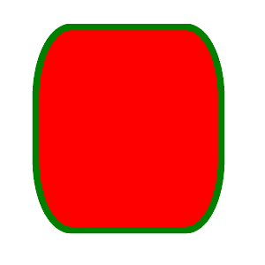

# PHP|ImagickDraw round Rectangle()函数

> Original: [https://www.geeksforgeeks.org/php-imagickdraw-roundrectangle-function/](https://www.geeksforgeeks.org/php-imagickdraw-roundrectangle-function/)

**ImagickDraw：：round Rectangle()**函数是 PHP 的 Imagick 库中的内置函数，用于绘制圆角矩形。

**语法：**

```
*bool* ImagickDraw::roundRectangle( $x1, $y1, $x2, $y2, $rx, $ry )
```

**参数：**此函数接受上述 6 个参数，如下所述：

*   **$x1：**此参数取左上角的 x 坐标值。
*   **$y1：**此参数取左上角的 y 坐标值。
*   **$x2：**此参数取右下角的 x 坐标值。
*   **$y2：**此参数取右下角的 y 坐标值。
*   **$rx：**此参数采用 x 舍入的值。
*   **$ry：**此参数采用 y 舍入的值。

**返回值：**如果成功，此函数返回 TRUE。

下面的程序演示了 PHP 中的**ImagickDraw：：round Rectangle()函数**：

**程序：**

```
<?php
// require_once('vendor/autoload.php');

// Create ImagickDraw object
$draw = new \ImagickDraw();

$draw->setStrokeColor('Green');
$draw->setFillColor('Red');
$draw->setStrokeWidth(7);

$draw->roundRectangle(40, 30, 250, 260, 40, 80);

// Create an image object which the draw 
// commands can be rendered into
$image = new \Imagick();
$image->newImage(300, 300, 'White');
$image->setImageFormat("png");

// Render the draw commands in the ImagickDraw object 
// into the image.

$image->drawImage($draw);

// Send the image to the browser
header("Content-Type: image/png");
echo $image->getImageBlob();
?>
```

**输出：**


**引用：**[http://php.net/manual/en/imagickdraw.roundrectangle.php](http://php.net/manual/en/imagickdraw.roundrectangle.php)