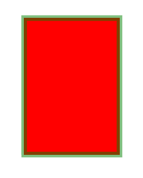

# PHP|ImagickDraw setFillColor()函数

> Original: [https://www.geeksforgeeks.org/php-imagickdraw-setfillcolor-function/](https://www.geeksforgeeks.org/php-imagickdraw-setfillcolor-function/)

**ImagickDraw：：setFillColor()**函数是 PHP 中的一个内置函数，用于设置绘制时使用的填充颜色。

**语法：**

```
*bool* ImagickDraw::setFillColor( $fill_pixel )
```

**参数：**此函数接受单个参数<en>$Fill_Pixel，该参数用于保存像素颜色值。</en>

**返回值：**此函数不返回任何值。

下面的程序说明 PHP 中的**ImagickDraw：：setFillColor()函数**：

**程序 1：**

```
<?php

// require_once('path/vendor/autoload.php');

// Create an ImagickDraw object
$draw = new \ImagickDraw();

// Set stroke opacity
$draw->setStrokeOpacity(1);

// Set stroke color
$draw->setStrokeColor('Black');

// Set stroke opacity
$draw->setStrokeOpacity(0.8);

// Set stroke width
$draw->setStrokeWidth(10);

// Set Stroke Line Join
$draw->setStrokeLineJoin(Imagick::LINEJOIN_ROUND);

// Set Fill Color
$draw->setFillColor('lightgreen');

// Set Stroke Miter Limit
$draw->setStrokeMiterLimit(40 * 12);

$points = [
        ['x' => 50 * 6, 'y' => 10 * 5],
        ['x' => 20 * 7, 'y' => 30 * 5], 
        ['x' => 60 * 8, 'y' => 50 * 5], 
        ['x' => 70 * 3, 'y' => 15 * 5],
    ];

// Draw a polygon
$draw->polygon($points);

// Create a new imagick object
$image = new \Imagick();

// Set image dimensions
$image->newImage(500, 300, 'white');

// Set the image format 
$image->setImageFormat("png");

// Draw the image
$image->drawImage($draw);
header("Content-Type: image/png");

// Display the image
echo $image->getImageBlob();
?>
```

**输出：**


**程序 2：**

。 ]

**输出：**


**引用：**[http://php.net/manual/en/imagickdraw.setfillcolor.php](http://php.net/manual/en/imagickdraw.setfillcolor.php)