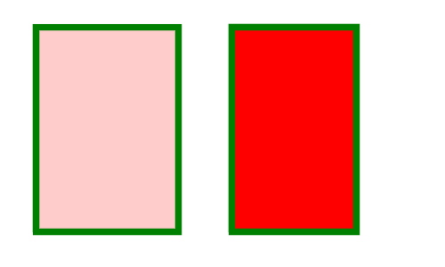
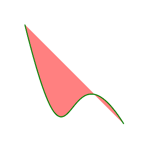

# PHP|ImagickDraw setFillOpacity()函数

> Original: [https://www.geeksforgeeks.org/php-imagickdraw-setfillopacity-function/](https://www.geeksforgeeks.org/php-imagickdraw-setfillopacity-function/)

**ImagickDraw：：setFillOpacity()**函数是 PHP 中的一个内置函数，用于设置使用填充颜色或填充纹理绘制时要使用的不透明度。
**语法：**

```php
*bool* ImagickDraw::setFillOpacity( $fillOpacity ) 
```

**参数：**此函数接受单个参数*$fulOpacity*，该参数用于将不透明度的值保存为浮点型。
**返回值：**此函数不返回任何值。
下面的程序说明了 PHP：
**程序 1：**中的**ImagickDraw：：setFillOpacity()函数**

## PHP

```php
<?php

// require_once('vendor/autoload.php');

// Create ImagickDraw object
$draw = new \ImagickDraw();

// Set the stroke color
$draw->setStrokeColor('Green');

// Use setFillColor() Function
$draw->setFillColor('Red');

// Use setFillOpacity() Function
$draw->setFillOpacity(0.2);

$draw->setStrokeWidth(7);

// Create rectangle
$draw->rectangle(40, 30, 200, 260);

// Use setFillColor() Function
$draw->setFillColor('Red');

// Create rectangle of given size
$draw->rectangle(260, 30, 400, 260);

// Create an Imagick object
$image = new \Imagick();

$image->newImage(500, 300, 'white');

// Set the image format
$image->setImageFormat("png");

// Render the draw commands in the
// ImagickDraw object into the image.
$image->drawImage($draw);

// Send the image to the browser
header("Content-Type: image/png");
echo $image->getImageBlob();

?>
```

发帖主题：Re：Колибри0.7.0



**程序 2：**

## PHP

```php
<?php

// require_once('path/vendor/autoload.php');

// Create new ImagickDraw object
$draw = new \ImagickDraw();

// Set the stroke color
$strokeColor = new \ImagickPixel('Green');

// Set the filled color
$fillColor = new \ImagickPixel('Red');

// Set the stroke color
$draw->setStrokeColor('Green');

// Set the filled color
$draw->setFillColor('Red');

// Use setFillOpacity() Function
$draw->setFillOpacity(0.5);

// Set the stroke width
$draw->setStrokeWidth(2);

$smoothPointsSet = [ [
          ['x' => 10.0 * 5, 'y' => 10.0 * 5],
          ['x' => 30.0 * 5, 'y' => 90.0 * 5],
          ['x' => 25.0 * 5, 'y' => 10.0 * 5],
          ['x' => 50.0 * 5, 'y' => 50.0 * 5], ] ];

foreach ($smoothPointsSet as $points) {
    $draw->bezier($points);
}

// Create an image object
$imagick = new \Imagick();

$imagick->newImage(300, 300, 'White');

// Set the image format
$imagick->setImageFormat("png");

// Render the draw commands in the
// ImagickDraw object into the image.
$imagick->drawImage($draw);

// Send the image to the browser
header("Content-Type: image/png");
echo $imagick->getImageBlob();
?>
```

发帖主题：Re：Колибри0.7.0



**引用：**[http://php.net/manual/en/imagickdraw.setfillopacity.php](http://php.net/manual/en/imagickdraw.setfillopacity.php)