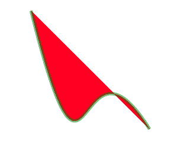
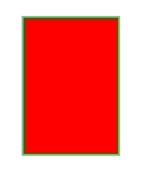

# PHP|ImagickDraw setStrokeAlpha()函数

> Original: [https://www.geeksforgeeks.org/php-imagickdraw-setstrokealpha-function/](https://www.geeksforgeeks.org/php-imagickdraw-setstrokealpha-function/)

**ImagickDraw：：setStrokeAlpha()**函数是 PHP 中的内置函数，用于指定描边对象轮廓的不透明度。

**语法：**

```
*bool* ImagickDraw::setStrokeAlpha( $opacity )
```

**参数：**此函数接受单个参数*不透明度*，该参数用于指定笔划对象的透明度。 它是浮点值，介于 0 和 1 之间。

**返回值：**此函数不返回任何值。

下面的程序说明了 PHP 中的**ImagickDraw：：setStrokeAlpha()**函数：

**程序 1：**

```
<?php

// require_once('path/vendor/autoload.php');

// Create an Imagick Draw object
$draw = new \ImagickDraw();

// Set the stroke color
$strokeColor = new \ImagickPixel('Green');

// Set the fill color
$fillColor = new \ImagickPixel('Red');

// Set the stroke color
$draw->setStrokeColor('Green');

// Set the Fill Color
$draw->setFillColor('Red');

// Set the stroke width
$draw->setStrokeWidth(5);

// Set the stroke opacity
$draw->setStrokeOpacity(0.5);

$smoothPointsSet = [
        [ ['x' => 10.0 * 5, 'y' => 10.0 * 5],
          ['x' => 30.0 * 5, 'y' => 90.0 * 5],
          ['x' => 25.0 * 5, 'y' => 10.0 * 5],
          ['x' => 50.0 * 5, 'y' => 50.0 * 5], ]
    ];

foreach ($smoothPointsSet as $points) {
    $draw->bezier($points);
}

// Create an imagick object
$imagick = new \Imagick();

// Set the image dimensions
$imagick->newImage(300, 300, 'White');

// Set the image format
$imagick->setImageFormat("png");

// Draw the image
$imagick->drawImage($draw);
header("Content-Type: image/png");

// Display the image
echo $imagick->getImageBlob();
?>
```

**输出：**


**程序 2：**

```
<?php

// require_once('path/vendor/autoload.php');

// Create an ImagickDraw object

$draw = new \ImagickDraw();

// Set the Stroke Color 
$draw->setStrokeColor('Green');

// Set the Fill Color
$draw->setFillColor('Red');

// Set the stroke width
$draw->setStrokeWidth(7);

// Set the stroke opacity
$draw->setStrokeOpacity(0.5);

// Draw the rectangle
$draw->rectangle(40, 30, 200, 260);

// Create an Imagick object 
$image = new \Imagick();

// Set the image dimensions
$image->newImage(250, 300, 'White');

// Set the image format
$image->setImageFormat("png");

// Draw the image
$image->drawImage($draw);
header("Content-Type: image/png");

// Display the image 
echo $image->getImageBlob();
?>
```

**输出：**


**引用：**[http://php.net/manual/en/imagickdraw.setstrokealpha.php](http://php.net/manual/en/imagickdraw.setstrokealpha.php)