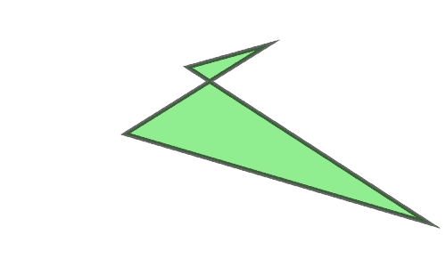
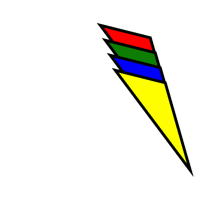

# PHP|ImagickDraw setStrokeMiterLimit()函数

> Original: [https://www.geeksforgeeks.org/php-imagickdraw-setstrokemiterlimit-function/](https://www.geeksforgeeks.org/php-imagickdraw-setstrokemiterlimit-function/)

**ImagickDraw：：setStrokeMiterLimit()**函数是 PHP 中的内置函数，用于指定笔划的斜接限制。 如果两个线段以锐角相交，并且已为“lineJoin”指定了斜接，则斜接可能会延伸到远远超出描边路径的线的厚度。 MiterLimit‘对斜接长度与’line Width‘的比率施加限制。

**语法：**

```php
*bool* ImagickDraw::setStrokeMiterLimit( $miterlimit )
```

**参数：**此函数接受单个参数*$miterlimit*，该参数用于将斜接限制的值保存为整数类型。

**返回值：**此函数不返回任何值。

下面的程序演示了 PHP 中的**ImagickDraw：：setStrokeMiterLimit()**函数：

**程序 1：**

```php
<?php

// require_once('path/vendor/autoload.php');

// Create an ImagickDraw object
$draw = new \ImagickDraw();

// Set the Stroke Opacity
$draw->setStrokeOpacity(1);

// Set the Stroke Color
$draw->setStrokeColor('Black');

// Set the Stroke Opacity
$draw->setStrokeOpacity(0.6);

// Set the Stroke Width  
$draw->setStrokeWidth(4);

// Set the image filled color 
$draw->setFillColor('lightgreen');

// Set the Stroke Miter Limit 
$draw->setStrokeMiterLimit(40 * 12);
$points = [
        ['x' => 50 * 6, 'y' => 10 * 5],
        ['x' => 20 * 7, 'y' => 30 * 5], 
        ['x' => 60 * 8, 'y' => 50 * 5], 
        ['x' => 70 * 3, 'y' => 15 * 5],
    ];

// Draw the polygon 
$draw->polygon($points);

// Create new Imagick object 
$image = new \Imagick();

// Set the dimensions of the image
$image->newImage(500, 300, 'white');

// Set the image format
$image->setImageFormat("png");

// Draw the image
$image->drawImage($draw);
header("Content-Type: image/png");

// Display the Image
echo $image->getImageBlob();
?>
```

**输出：**


**程序 2：**

```php
<?php

// require_once('path/vendor/autoload.php');

// Create a ImagickDraw object to draw into.
$draw = new ImagickDraw();

// Set the Stroke Width
$draw->setStrokeWidth(5);

// Set the Stroke Miter Limit
$draw->setStrokeMiterLimit(50 * 15);

// Set the Stroke Color
$draw->setStrokeColor('black');

// Set the image filled color
$draw->setFillColor('red');
$points = [['x' => 40 * 5, 'y' => 10 * 5],
          ['x' => 70 * 5, 'y' => 50 * 5], 
          ['x' => 60 * 5, 'y' => 15 * 5], ];

// Draw the polygon 
$draw->polygon($points);

// Set the image filled color
$draw->setFillColor('green');

// Set the translation points
$draw->translate(10, 30);
$points = [['x' => 40 * 5, 'y' => 10 * 5],
           ['x' => 70 * 5, 'y' => 50 * 5], 
           ['x' => 60 * 5, 'y' => 15 * 5], ];

// Draw the polygon
$draw->polygon($points);

// Set the image filled color
$draw->setFillColor('blue');

// Set the translation points
$draw->translate(10, 30);
$points = [['x' => 40 * 5, 'y' => 10 * 5], 
           ['x' => 70 * 5, 'y' => 50 * 5], 
           ['x' => 60 * 5, 'y' => 15 * 5], ];

// Draw the polygon
$draw->polygon($points);

// Set the image filled color
$draw->setFillColor('yellow');

// Set the translation points
$draw->translate(10, 30);
$points = [['x' => 40 * 5, 'y' => 10 * 5], 
           ['x' => 70 * 5, 'y' => 50 * 5], 
           ['x' => 60 * 5, 'y' => 15 * 5], ];

// Draw the polygon
$draw->polygon($points);

// Create new Imagick object 
$image = new Imagick();

// Set the dimensions of the image
$image->newImage(400, 400, 'white');

// Set the image format
$image->setImageFormat("png");

// Draw the image 
$image->drawImage($draw);
header("Content-Type: image/png");

// Display the image
echo $image->getImageBlob();
?>
```

**输出：**


**引用：**[http://php.net/manual/en/imagickdraw.setstrokemiterlimit.php](http://php.net/manual/en/imagickdraw.setstrokemiterlimit.php)