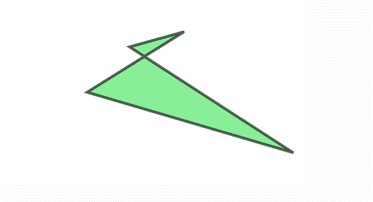

# PHP|ImagickDraw setStrokeOpacity()函数

> Original: [https://www.geeksforgeeks.org/php-imagickdraw-setstrokeopacity-function/](https://www.geeksforgeeks.org/php-imagickdraw-setstrokeopacity-function/)

**ImagickDraw：：setStrokeOpacity()**函数是 PHP 中的内置函数，用于指定描边对象轮廓的不透明度。 不透明度的值介于 0 到 1 之间。

**语法：**

```
*bool* ImagickDraw::setStrokeOpacity( $stroke_opacity )
```

**参数：**此函数接受单个参数*$kes_opacity*，该参数用于将笔划不透明度的值保存为浮点类型。

**返回值：**此函数不返回任何值。

下面的程序说明了 PHP 中的**ImagickDraw：：setStrokeOpacity()**函数：

**程序 1：**

```
<?php

// require_once('path/vendor/autoload.php');

// Create an ImagickDraw object to draw into. 
$draw = new \ImagickDraw();

// Set the stroke color 
$draw->setStrokeColor('Green');

// Set the filled color 
$draw->setFillColor('Red');

// Set the stroke opacity 
$draw->setStrokeOpacity(0.5);

// Set the stroke width
$draw->setStrokeWidth(9);

// Draw the rectangle
$draw->rectangle(40, 30, 200, 260);

// Create new imagick object 
$image = new \Imagick();

// Create new image of given size 
$image->newImage(240, 300, 'White');

// Set the image format 
$image->setImageFormat("png");

// Draw the image
$image->drawImage($draw);

header("Content-Type: image/png");

// Display the output image
echo $image->getImageBlob();
?>
```

**输出：**


**程序 2：**

```
<?php

// require_once('path/vendor/autoload.php');

// Create an ImagickDraw object to draw into. 
$draw = new \ImagickDraw();

// Set the Stroke Color
$draw->setStrokeColor('Black');

// Set the Stroke Opacity
$draw->setStrokeOpacity(0.6);

// Set the Stroke Width
$draw->setStrokeWidth(4);

//Set the filled color 
$draw->setFillColor('lightgreen');
$points = [
        ['x' => 50 * 6, 'y' => 10 * 5],
        ['x' => 20 * 7, 'y' => 30 * 5], 
        ['x' => 60 * 8, 'y' => 50 * 5], 
        ['x' => 70 * 3, 'y' => 15 * 5],
    ];

// Draw the polygon 
$draw->polygon($points);

// Create new Imagick object
$image = new \Imagick();

// Set the image dimensions
$image->newImage(500, 300, 'white');

// Set the image format 
$image->setImageFormat("png");

// Draw the image 
$image->drawImage($draw);

header("Content-Type: image/png");

// Display the image 
echo $image->getImageBlob();
?>
```

**输出：**


**引用：**[http://php.net/manual/en/imagickdraw.setstrokeopacity.php](http://php.net/manual/en/imagickdraw.setstrokeopacity.php)