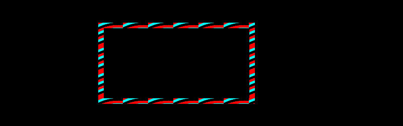

# PHP|ImagickDraw setStrokePatternURL()函数

> Original: [https://www.geeksforgeeks.org/php-imagickdraw-setstrokepatternurl-function/](https://www.geeksforgeeks.org/php-imagickdraw-setstrokepatternurl-function/)

**ImagickDraw：：setStrokePatternURL()函数**是 PHP 中的内置函数，用于设置用于描边对象轮廓的图案。

**语法：**

```php
*bool* ImagickDraw::setStrokePatternURL( *string* $stroke_url )
```

**参数：**此函数接受单个参数**$kes_url**，该参数保存笔划模式的 URL。

**返回值：**如果成功，此函数返回 TRUE。

下面给出的程序演示了 PHP 中的**ImagickDraw：：setStrokePatternURL()函数**：

**程序 1：**在本程序中，我们将创建一个具有设计轮廓的矩形。

```php
<?php

// Create a new imagick object
$imagick = new Imagick();

// Create a image on imagick object
$imagick->newImage(800, 250, 'black');

// Create a new imagickDraw object
$draw = new ImagickDraw();

// Push the pattern
$draw->pushPattern("MyPattern", 0, 0, 50, 50);
$color = ['red', 'black', 'cyan'];

for ($x = 0; $x < 50; $x += 10) {
    for ($y = 0; $y < 50; $y += 5) {
        $draw->setFillColor($color[$y % 3]);
        $draw->circle($x, $y + 80, $x % 2, $y);
    }
}

// Pop the pattern
$draw->popPattern();

// Set the stroke pattern URL
$draw->setStrokePatternURL('#MyPattern');

// Set the stroke width
$draw->setStrokeWidth(10);

// Draw a rectangle on which pattern is made
$draw->rectangle(200, 50, 500, 200);

// Render the draw commands
$imagick->drawImage($draw);

// Show the output
$imagick->setImageFormat('png');
header("Content-Type: image/png");
echo $imagick->getImageBlob();
?>
```

**输出：**


**程序 2：**在本程序中，我们将创建一个具有设计轮廓的圆。

```php
<?php

// Create a new imagick object
$imagick = new Imagick();

// Create a image on imagick object
$imagick->newImage(800, 250, 'white');

// Create a new imagickDraw object
$draw = new ImagickDraw();

// Push the pattern
$draw->pushPattern("MyPattern", 0, 0, 50, 50);

for ($x = 0; $x < 50; $x += 10) { 
    for ($y = 0; $y < 50; $y += 5) { 
        $draw->setFillColor('green');
        $draw->rectangle($x, $y + 10, $x % 5, $y); 
    } 
} 

// Pop the pattern
$draw->popPattern();

// Set the stroke pattern URL
$draw->setStrokePatternURL('#MyPattern');

// Set the stroke width
$draw->setStrokeWidth(10);

// Draw a circle
$draw->circle(300, 100, 350, 20);

// Render the draw commands
$imagick->drawImage($draw);

// Show the output
$imagick->setImageFormat('png');
header("Content-Type: image/png");
echo $imagick->getImageBlob();
?>
```

**输出：**


**引用：**[https://www.php.net/manual/en/imagickdraw.setstrokepatternurl.php](https://www.php.net/manual/en/imagickdraw.setstrokepatternurl.php)