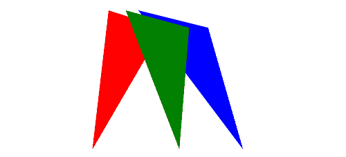
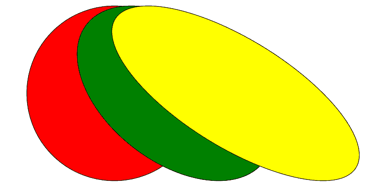

# PHP|ImagickDraw skewX()函数

> Original: [https://www.geeksforgeeks.org/php-imagickdraw-skewx-function/](https://www.geeksforgeeks.org/php-imagickdraw-skewx-function/)

**ImagickDraw：：skewX()**函数是 PHP 中的内置函数，用于在水平方向上倾斜当前坐标系。

**语法：**

```php
*bool* ImagickDraw::skewX( $degrees )
```

**参数：**此函数接受单个参数*$deegres*，该参数用于保持要倾斜的度数。

**返回值：**此函数不返回任何值。

下面的程序说明了 PHP 中的**ImagickDraw：：skewX()函数**：

**程序 1：**

```php
<?php

// require_once('path/vendor/autoload.php');

// Create an ImagickDraw object to draw into.
$draw = new ImagickDraw();

// Set the image filled color
$draw->setFillColor('blue');
$points = [['x' => 40 * 5, 'y' => 10 * 5], 
           ['x' => 70 * 5, 'y' => 50 * 5], 
           ['x' => 60 * 5, 'y' => 15 * 5], ];

// Draw the polygon
$draw->polygon($points);

// Set the image filled color
$draw->setFillColor('red');
$draw->skewX(-60);
$points = [['x' => 40 * 5, 'y' => 10 * 5], 
           ['x' => 70 * 5, 'y' => 50 * 5], 
           ['x' => 60 * 5, 'y' => 15 * 5], ];

// Draw the polygon           
$draw->polygon($points);

// Set the image filled color
$draw->setFillColor('green');
$draw->skewX(30);
$points = [['x' => 40 * 5, 'y' => 10 * 5], 
           ['x' => 70 * 5, 'y' => 50 * 5], 
           ['x' => 60 * 5, 'y' => 15 * 5], ];

// Draw the polygon           
$draw->polygon($points);

// Create new Imagick object
$image = new Imagick();
$image->newImage(500, 500, 'white');

// Set the image format
$image->setImageFormat("png");

// Draw the image
$image->drawImage($draw);

header("Content-Type: image/png");

// Display the image
echo $image->getImageBlob();
?>
```

**输出：**


**程序 2：**

```php
<?php

// require_once('path/vendor/autoload.php');

// Create an ImagickDraw object
$draw = new ImagickDraw();

// Set the stroke color
$draw->setStrokeColor('black');

// Set the filled color
$draw->setFillColor('red');

// Draw the circle
$draw->circle(250, 250, 100, 150); 

// Set the filled color
$draw->setFillColor('green');

// Set the skew of X
$draw->skewX(30);

// Draw the circle
$draw->circle(250, 250, 100, 150); 

// Set the filled color
$draw->setFillColor('yellow');

// Set the skew of X
$draw->skewX(30);

// Draw the circle
$draw->circle(250, 250, 100, 150); 

// Create new imagick object
$image = new Imagick();

// Create new image of given size
$image->newImage(900, 600, 'white');

// Set the image format
$image->setImageFormat("png");

// Draw the image
$image->drawImage($draw);

header("Content-Type: image/png");

// Display the output image
echo $image->getImageBlob();
?>
```

**输出：**


**引用：**[http://php.net/manual/en/imagickdraw.skewx.php](http://php.net/manual/en/imagickdraw.skewx.php)