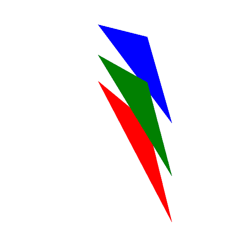
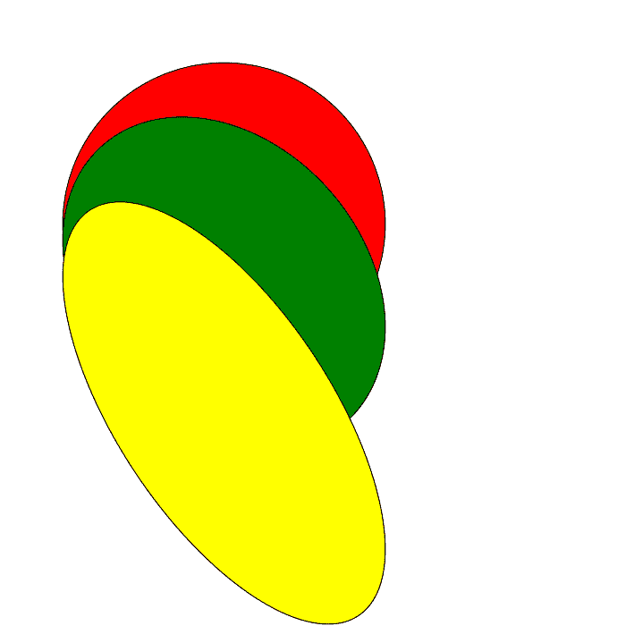

# PHP|ImagickDraw skewy()函数

> Original: [https://www.geeksforgeeks.org/php-imagickdraw-skewy-function/](https://www.geeksforgeeks.org/php-imagickdraw-skewy-function/)

**ImagickDraw：：skewy()**函数是 PHP 中的一个内置函数，用于在垂直方向上倾斜当前坐标系。

**语法：**

```php
*bool* ImagickDraw::skewY( $degrees )
```

**参数：**此函数接受单个参数*$deegres*，该参数用于保持要倾斜的度数。

**返回值：**此函数不返回任何值。

下面的程序演示了 PHP 中的**ImagickDraw：：skewy()函数**：

**程序 1：**

```php
<?php

// require_once('path/vendor/autoload.php');

// Create an ImagickDraw object.
$draw = new ImagickDraw();

// Set the image filled color
$draw->setFillColor('blue');
$points = [['x' => 40 * 5, 'y' => 10 * 5], 
           ['x' => 70 * 5, 'y' => 50 * 5], 
           ['x' => 60 * 5, 'y' => 15 * 5], ];

// Draw the polygon
$draw->polygon($points);

// Set the image filled color
$draw->setFillColor('red');
$draw->skewY(-60);
$points = [['x' => 40 * 5, 'y' => 10 * 5], 
           ['x' => 70 * 5, 'y' => 50 * 5],
           ['x' => 60 * 5, 'y' => 15 * 5], ];

// Draw the polygon
$draw->polygon($points);

// Set the image filled color
$draw->setFillColor('green');
$draw->skewY(30);
$points = [['x' => 40 * 5, 'y' => 10 * 5], 
           ['x' => 70 * 5, 'y' => 50 * 5], 
           ['x' => 60 * 5, 'y' => 15 * 5], ];

// Draw the polygon
$draw->polygon($points);

// Create new Imagick object 
$image = new Imagick();

// Set the image dimensions
$image->newImage(500, 500, 'white');

// Set the image format
$image->setImageFormat("png");

// Draw the image 
$image->drawImage($draw);
header("Content-Type: image/png");

// Display the image
echo $image->getImageBlob();
?>
```

**输出：**


**程序 2：**

```php
<?php

// require_once('path/vendor/autoload.php');

// Create an ImagickDraw object
$draw = new ImagickDraw();

// Set the stroke color
$draw->setStrokeColor('black');

// Set the image filled color
$draw->setFillColor('red');

// Draw the circle
$draw->circle(250, 250, 100, 150); 

// Set the image filled color
$draw->setFillColor('green');
$draw->skewY(-30);

// Draw the circle
$draw->circle(250, 250, 100, 150); 

// Set the image filled color
$draw->setFillColor('yellow');
$draw->skewY(-60);

// Draw the circle
$draw->circle(250, 250, 100, 150); 

// Create new Imagick object 
$image = new Imagick();

// Set the image dimensions
$image->newImage(700, 700, 'white');

// Set the image format
$image->setImageFormat("png");

// Draw the image 
$image->drawImage($draw);
header("Content-Type: image/png");

// Display the image
echo $image->getImageBlob();
?>
```

**输出：**


**引用：**[http://php.net/manual/en/imagickdraw.skewy.php](http://php.net/manual/en/imagickdraw.skewy.php)