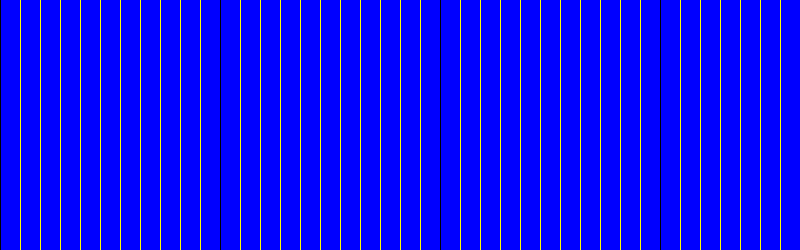

# PHP|ImagickPixelIterator syncIterator()函数

> Original: [https://www.geeksforgeeks.org/php-imagickpixeliterator-synciterator-function/](https://www.geeksforgeeks.org/php-imagickpixeliterator-synciterator-function/)

**ImagickPixelIterator：：syncIterator()函数**是 PHP 中的内置函数，用于同步像素迭代器。

**语法：**

```
*bool* ImagickPixelIterator::syncIterator( *void* )
```

**参数：**此函数不接受任何参数。

**返回值：**如果成功，此函数返回 TRUE。

**异常：**此函数在出错时引发 ImagickException。

下面给出的程序演示了 PHP 中的**ImagickPixelIterator：：syncIterator()函数**：

**程序 1：**

```
<?php
// Create a new imagick object
$imagick = new Imagick();

// Create a image on imagick object
$imagick->newImage(800, 250, 'black');

$imageIterator = $imagick->getPixelIterator();

// Loop through rows pixel value
foreach ($imageIterator as $pixels) {

    // Loop through the pixels in the row value
    foreach ($pixels as $column => $pixel) {

        if ($column % 11) {
            $pixel->setColor('yellow');
        }
    }
    // Sync the iterator after each iteration
    $imageIterator->syncIterator();
}

// Loop through pixel rows again for new color
foreach ($imageIterator as $pixels) {
    // Loop through the pixels in the row
    foreach ($pixels as $column => $pixel) {
        if ($column % 20) {
            $pixel->setColor('blue');
        }
    }

    // Sync the iterator after each iteration
    $imageIterator->syncIterator();
}

// Show the output
$imagick->setImageFormat('png');
header("Content-Type: image/png");
echo $imagick->getImageBlob();
?>
```

**输出：**


**程序 2：**

```
<?php
// Create a new imagick object
$imagick = new Imagick(
    'https://media.geeksforgeeks.org/wp-content/uploads/geeksforgeeks-13.png');

$imageIterator = $imagick->getPixelIterator();

// Loop through pixel rows
foreach ($imageIterator as $pixels) {
    // Loop through the pixels in the row
    foreach ($pixels as $column => $pixel) {

        // Get the current HSL
        $HSL = $pixel->getHSL();

        // Set the HSL and change only saturation
        $pixel->setHSL($HSL['hue'], 2, $HSL['luminosity']);
    }
    // Sync the iterator after each iteration
    $imageIterator->syncIterator();
}

// Show the output
$imagick->setImageFormat('png');
header("Content-Type: image/png");
echo $imagick->getImageBlob();
?>
```

**输出：**


**引用：**[https://www.php.net/manual/en/imagickpixeliterator.synciterator.php](https://www.php.net/manual/en/imagickpixeliterator.synciterator.php)