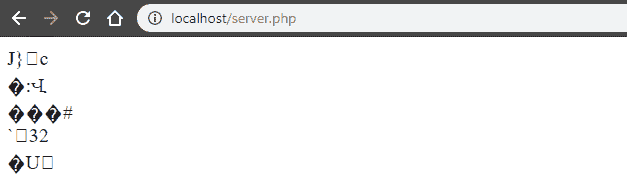

# PHP|inet_pton()函数

> Original: [https://www.geeksforgeeks.org/php-inet_pton-function/](https://www.geeksforgeeks.org/php-inet_pton-function/)

函数**inet_pton()**是 PHP 中的一个内置函数，用于将可读格式的 IP 地址转换为打包的 32 位 IPv4 或 128 位 IPv6 地址。

**语法：**

```
*string* inet_pton( *string* $ip_address )
```

**参数：**此函数接受上述单个参数，如下所述：

*   **$IP_ADDRESS：**必选参数。 它指定了可读的 IP 地址。

**返回值：**此函数成功时返回打包的 32 位 IPv4 或 128 位 IPv6 地址，失败时返回 False。

**注：**

*   此函数适用于 PHP 5.1.0 及更高版本。
*   以下示例的输出在本页和实际输出中可能不同。 所以请看输出截图。

下面的程序演示了 PHP 中的 inet_pton()函数：

**程序 1：**

```
<?php

// Use inet_pton() function on IP
// address and get result
$addr = inet_pton("127.0.1.1");

echo $addr;

?>
```

**输出：**


**程序 2：**

```
<?php

echo inet_pton("".gethostbyname("www.google.com"))."<br>";
echo inet_pton("".gethostbyname("www.youtube.com"))."<br>";
echo inet_pton("".gethostbyname("www.facebook.com"))."<br>";
echo inet_pton("".gethostbyname("www.geeksforgeeks.org"))."<br>";
echo inet_pton("".gethostbyname("php.net"))."<br>";

?>
```

**输出：**


**引用：**[https://www.php.net/manual/en/function.inet-pton.php](https://www.php.net/manual/en/function.inet-pton.php)