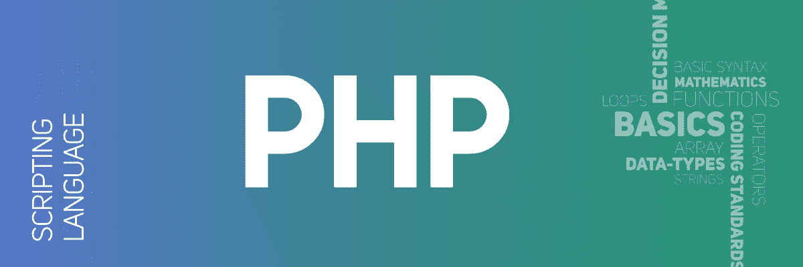

# PHP 面试问答|SET-2

> Original: [https://www.geeksforgeeks.org/php-interview-questions-and-answers-set-2/](https://www.geeksforgeeks.org/php-interview-questions-and-answers-set-2/)



我们已经在[PHP 面试问答|Set-1](https://www.geeksforgeeks.org/php-interview-questions-and-answers/)中讨论了一些问题。 以下是一些更相关的问题：

1.  **How can you enable error reporting in PHP ?**
    If you are getting errors and you don’t have idea about those errors then you can use inbuilt **error_reporting()** function. This function will give you information about those errors where and why it is happening. The best place to include this function is the beginning of your PHP script. You can also set this function for some specific script or you can set it for all the scripts in your server by editing the **php.ini** file.
2.  **[What is the main error types and how they differ ?](https://www.geeksforgeeks.org/php-types-of-errors/)**
    There are various type of errors in PHP but it contains basically four main types of errors.
    *   **解析错误或语法错误：**这是程序员在程序源代码中犯的错误类型。 由于非右引号、缺少或多余的圆括号、非右大括号、缺少分号等原因，可能会导致解析错误。
    *   **致命错误：**这是一种错误类型，PHP 编译器理解 PHP 代码，但它识别未声明的函数。 这意味着在没有定义函数的情况下调用函数。
    *   **警告错误：**警告错误的主要原因是缺少文件。 这意味着 PHP 函数调用丢失的文件。
    *   **通知错误：**类似于警告错误。 这意味着程序包含一些错误，但它允许执行脚本。

3.  **What is inheritance in PHP ?**
    Inheritance in PHP means the child class can inherit all the properties and protected methods from it’s parent class and extend keyword is used to define the inheritance.
4.  **[Is PHP supports multiple inheritance ?](https://www.geeksforgeeks.org/multiple-inheritance-in-php/)**
    PHP doesn’t support multiple inheritance but by using Interfaces in PHP or using Traits in PHP instead of classes we can implement it.
5.  [**What are Traits in PHP ?**](https://www.geeksforgeeks.org/multiple-inheritance-in-php/)
    The trait is a type of class which enables multiple inheritance. Classes, case classes, objects, and traits can all extend no more than one class but can extend multiple traits at the same time.
6.  [**What is difference between GET and POST ?**](https://www.geeksforgeeks.org/http-get-post-methods-php/)
    *   **GET：**它从指定的资源请求数据。 在此方法中，数据作为 URL 参数发送，这些参数通常是名称和值对的字符串，由与号分隔(&)。
        **语法：**

        ```php
        <?php
        $_GET['variable_name'];
        ?>
        ```

    *   **POST：**在此方法中，数据以包的形式发送到服务器，并与处理脚本进行单独通信。 通过 POST 方法发送的数据在 URL 中不可见。
        **语法：**

        ```php
        <?php
        $_POST['variable_name'];
        ?>
        ```

7.  [**What is the difference between the unset() and unlink() functions ?**](https://www.geeksforgeeks.org/php-unset-vs-unlink-function/)
    *   **unlink()函数：**unlink()函数是 PHP 中内置的函数，用于删除文件。 必须删除的文件的文件名作为参数发送，函数成功时返回 True，失败时返回 False。 PHP 中的 unlink()函数接受两个参数**filename**和**context**。
    *   **unset()函数：**unset()函数是 PHP 中的一个内置函数，用于通过清空文件来删除文件中的内容。 这意味着该功能清除文件的内容，而不是删除它。 函数的作用是：不仅清除文件内容，还用于取消变量的设置，从而使其为空，并接受单个参数变量。
8.  **If x = 10 and y = “10” then what does the condition x === y returns ?**

    ```php
    <?php
    $x = 10;  
    $y = "10";

    var_dump($x === $y); 
    ?> 
    ```

    它将返回**bool(False)**。

9.  **What is Nullable types in PHP ?**
    This feature is new to PHP, Nullable adds a leading question mark indicate that a type can also be null.

    ```php
    function geeks(): ?int  {
        return null; // ok
    }
    ```

10.  [**What is the maximum size of a file that can be uploaded using PHP ?**](https://www.geeksforgeeks.org/how-to-change-the-maximum-upload-file-size-in-php/)
    BY default maximum upload file size for PHP scripts is set to 128 megabytes. But you can change it, the maximum size of any file that can be uploaded on a website written in PHP is determined by the values of max_size that can be posted or uploaded, mentioned in the **php.ini** file of the server. In case of a hosted server need to contact the administrator of the hosting server but XAMPP has interpreters for the scripts written in PHP and Perl. It helps to create a local HTTP server for developers and it provides them full physical and administrative access to the local server. Hence it is the most widely used server and it is very easy to increase the limit on upload files to the desired value in this server.
11.  [**How can we increase the execution time of a PHP script ?**](https://www.geeksforgeeks.org/maximum-execution-time-taken-by-a-php-script/)
    Use PHP inbuilt function ini_set(option, value) where the parameters are the given configuration option and the value to be set. It is used when you need to override the configuration value at run-time. This function is called from your own PHP code and will only affect the script which calls this function. Use init_set(‘max_execution_time’, 0) when you want to set unlimited execution time for the script.

    ```php
    // The program is executed for 3mns. 
    <?php 
    ini_set('max_execution_time', 180); 
    ?> 
    ```

12.  [**What is the difference between the include() and require() functions ?**](https://www.geeksforgeeks.org/php-inclusion/)
    *   **include()函数：**该函数用于将函数内调用的文件的所有内容以文本方式复制到从中调用该函数的文件中。 这发生在服务器执行代码之前。
    *   **Required()函数：**Required()函数与 include()函数执行相同的操作。 它还获取所需的文件，并将整个代码复制到调用 Required()函数的文件中。
13.  [**What are the three access specifiers Public, Private and Protected in PHP ?**](https://www.geeksforgeeks.org/what-is-the-difference-between-public-private-and-protected-in-php/)
    *   **公共访问修饰符：**此修饰符可以在类内和类外使用。
    *   **受保护访问修饰符：**此修饰符可以在定义它的类及其父类或继承类中使用。
    *   **私有访问修饰符：**此修饰符可以在定义它的类中使用。 (它不能在类外访问，表示在继承类中)。
14.  [**解释飞船操作员的行为？**](https://www.geeksforgeeks.org/php-7-spaceship-operator/)
    飞船操作员或组合比较运算符用“<=>”表示。 这是一个三向比较运算符，它可以在两个操作数之间执行大于、小于和相等的比较。 =>
    =>

*   如果两边的值相等，则返回 0*   如果左侧的值较大，则返回 1*   Return -1 if the value on the right side is greater*   [**What are the __construct() and __destruct() methods in a PHP class ?**](https://www.geeksforgeeks.org/php-constructors-and-destructors/)
    *   **__struct()方法：**构造函数是定义未来对象及其性质的非常基本的构造块。 可以说，构造函数是对象创建的蓝图，为成员函数和成员变量提供值。

        ```php
        function __construct() {

            // Initialize the object and its
            // properties by assigning values
        }
        ```

    *   **__destruct()方法：**析构函数用于销毁对象，并在执行结束时自动调用。

        ```php
        function __destruct() {

            // Destroying the object or
            // clean up resources here 
        }
        ```

        *   **What is urlencode() and urldecode() ?**
    *   [**urlencode()函数：**](https://www.geeksforgeeks.org/php-urlencode-function/)urlencode()函数是 PHP 中的内置函数，用于对 URL 进行编码。 此函数返回一个字符串，该字符串包含除-_ 之外的所有非字母数字字符。 并替换为百分号(%)，后跟两个十六进制数字和编码为加号(+)的空格。
    *   [**urldecode()函数：**](https://www.geeksforgeeks.org/php-urldecode-function/)urldecode()函数是 PHP 中的内置函数，用于解码由 encode()函数编码的 URL。*   [**How to remove line breaks from the string ?**](https://www.geeksforgeeks.org/how-to-remove-line-breaks-from-the-string-in-php/)
    The line break can be removed from string by using str_replace() function. The str_replace() function is an inbuilt function in PHP which is used to replace all the occurrences of the search string or array of search strings by replacement string or array of replacement strings in the given string or array respectively.*   [**How to remove extension from string ?**](https://www.geeksforgeeks.org/how-to-remove-extension-from-string-in-php/)
    There are three ways of removing an extension from the string. They are as follows
    *   使用内置函数路径
    *   使用内置函数基名
    *   使用字符串函数 substr 和 strrpos*   **How to check the value of variable is a number, alphanumeric or empty ?**
    You can use **is_numeric() function** to check whether it is a number or not. The **ctype_alnum() function** is used to check whether it is an alphanumeric value or not and use the **empty() function** to check variable is empty or not.*   [**是否可以从数据中删除 HTML 标记？**](https://www.geeksforgeeks.org/php-strip_tags-function/)
    可以使用**strie_tag()函数**。 此函数是 PHP 中的内置函数，用于从 HTML 和 PHP 标记中剥离字符串。 此函数返回一个字符串，其中所有空字节、HTML 和 PHP 标记都从给定的$str 中剥离。