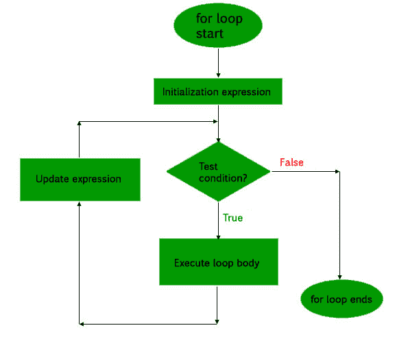
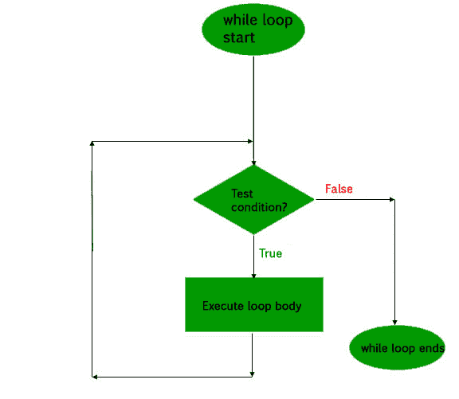
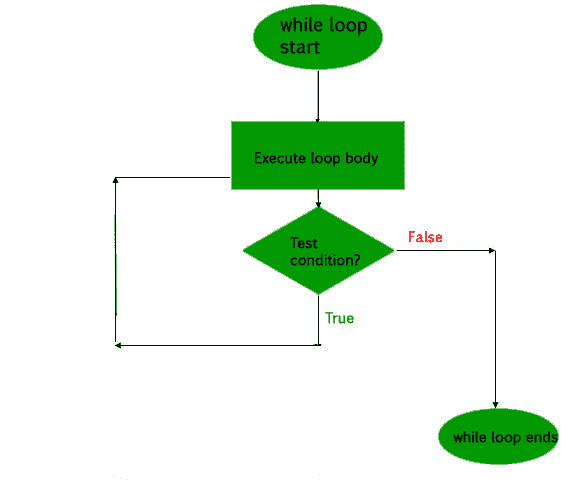

# PHP|循环

> Original: [https://www.geeksforgeeks.org/php-loops/](https://www.geeksforgeeks.org/php-loops/)

与任何其他语言一样，PHP 中的循环用于多次执行一条语句或一块语句，直到且除非满足特定条件。 这有助于用户节省多次编写相同代码的时间和精力。

PHP 支持四种类型的循环技术；

1.  For 循环
2.  While 循环
3.  Do-While 循环
4.  Foreach 循环

现在让我们详细了解一下上述每个循环：

1.  **for loop**: This type of loops is used when the user knows in advance, how many times the block needs to execute. That is, the number of iterations is known beforehand. These type of loops are also known as entry-controlled loops. There are three main parameters to the code, namely the initialization, the test condition and the counter.

    **语法**：

    ```php
    for (initialization expression; test condition; update expression) {
        // code to be executed
    }

    ```

    在 for 循环中，循环变量用于控制循环。 首先将此循环变量初始化为某个值，然后检查此变量是否小于或大于计数器值。 如果语句为真，则执行循环体并更新循环变量。 重复这些步骤，直到出现退出条件。

    *   **初始化表达式**：在此表达式中，我们必须将循环计数器初始化为某个值。 例如：$num=1；
    *   **测试表达式**：在此表达式中，我们必须测试条件。 如果条件的计算结果为真，那么我们将执行循环体并转到 UPDATE 表达式，否则我们将退出 for 循环。 例如：$num<=10；
    *   **更新表达式**：执行循环体后，该表达式将循环变量递增/递减一些值。 例如：$num+=2；

    示例：

    ```php
    <?php 

    // code to illustrate for loop
    for ($num = 1; $num <= 10; $num += 2) {
        echo "$num \n";
    } 

    ?>
    ```

    产出：

    ```php
    1
    3
    5
    7
    9

    ```

    **流程图**：

    

2.  **while loop**: The while loop is also an entry control loop like for loops i.e., it first checks the condition at the start of the loop and if its true then it enters the loop and executes the block of statements, and goes on executing it as long as the condition holds true.

    **语法**：

    ```php
    while (if the condition is true) {
        // code is executed
    }

    ```

    示例：

    ```php
    <?php

    // PHP code to illustrate while loops
    $num = 2;

    while ($num < 12) {
        $num += 2;
        echo $num, "\n";
    }

    ?>
    ```

    产出：

    ```php
    4
    6
    8
    10
    12

    ```

    **流程图**：

    

3.  **do-while loop**: This is an exit control loop which means that it first enters the loop, executes the statements, and then checks the condition. Therefore, a statement is executed at least once on using the do…while loop. After executing once, the program is executed as long as the condition holds true.

    **语法**：

    ```php
    do {

        //code is executed

    } while (if condition is true);

    ```

    示例：

    ```php
    <?php

    // PHP code to illustrate do...while loops
    $num = 2;
    do {
        $num += 2;
        echo $num, "\n";
    } while ($num < 12);

    ?>
    ```

    产出：

    ```php
    4
    6
    8
    10
    12

    ```

    此代码将显示 While 和 Do…之间的区别。 While 循环。

    ```php
    <?php

    // PHP code to illustrate the difference of two loops
    $num = 2;

    // In case of while
    while ($num != 2) {

        echo "In case of while the code is skipped";
        echo $num, "\n";

    }
    // In case of do...while
    do {

        $num++;
        echo "The do...while code is executed atleast once ";

    } while($num == 2);

    ?>
    ```

    产出：

    ```php
    The code is executed at least once 

    ```

    **流程图**：

    

4.  **foreach loop**: This loop is used to iterate over arrays. For every counter of loop, an array element is assigned and the next counter is shifted to the next element.
    **Syntax**:

    ```php
    foreach (array_element as value) {
       //code to be executed
    }

    ```

    示例：

    ```php
    <?php

        $arr = array (10, 20, 30, 40, 50, 60);
        foreach ($arr as $val) { 
            echo "$val \n";
        }

        $arr = array ("Ram", "Laxman", "Sita");
        foreach ($arr as $val) { 
            echo "$val \n";
        }

    ?>
    ```

    产出：

    ```php
    10 
    20 
    30 
    40 
    50 
    60 
    Ram 
    Laxman 
    Sita 

    ```

本文由[**Chinmoy Lenka**](https://auth.geeksforgeeks.org/profile.php?user=lenkachinmoy&list=practice)贡献。 如果你喜欢 GeeksforGeek 并想投稿，你也可以使用[Contribute.geeksforgeeks.org](http://www.contribute.geeksforgeeks.org)写一篇文章，或者把你的文章邮寄到 Contribute@geeksforgeeks.org。 看看你的文章出现在 GeeksforGeek 主页上，并帮助其他 Geek。

如果你发现任何不正确的地方，或者你想分享更多关于上面讨论的主题的信息，请写下评论。