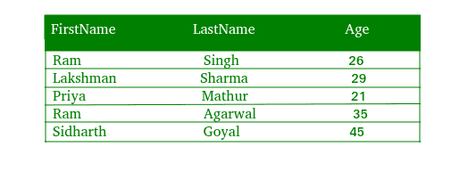
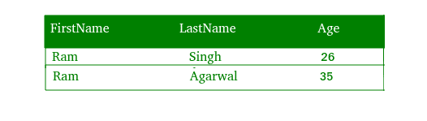

# PHP|MySQL WHERE 子句

> Original: [https://www.geeksforgeeks.org/php-mysql-clause/](https://www.geeksforgeeks.org/php-mysql-clause/)

**WHERE**子句用于仅筛选满足用户给定的特定条件的记录。 换句话说，SQL WHERE 子句用于限制受 SELECT、UPDATE 或 DELETE 查询影响的行数。

**语法：**
WHERE 子句的基本语法是-
**SELECT Column1，Column2，…。 。
FROM TABLE_NAME
WHERE 条件**

#### WHERE 条款的实施：

让我们考虑下面的表“Data”，它有三列‘FirstName’、‘LastName’和‘Age’。



要选择“FirstName”为“ram”的所有行，我们将使用以下代码：

**WHERE 子句使用程序方法：**

```
<?php
$link = mysqli_connect("localhost", "root", "", "Mydb");

if($link === false){
    die("ERROR: Could not connect. "
                . mysqli_connect_error());
}

$sql = "SELECT * FROM Data WHERE Firstname='ram'";
if($res = mysqli_query($link, $sql)){
    if(mysqli_num_rows($res) > 0){
        echo "<table>";
            echo "<tr>";
                echo "<th>Firstname</th>";
                echo "<th>Lastname</th>";
                echo "<th>age</th>";
            echo "</tr>";
        while($row = mysqli_fetch_array($res)){
            echo "<tr>";
                echo "<td>" . $row['Firstname'] . "</td>";
                echo "<td>" . $row['Lastname'] . "</td>";
                echo "<td>" . $row['Age'] . "</td>";
            echo "</tr>";
        }
        echo "</table>";
        mysqli_free_result($res);
    } else{
        echo "No Matching records are found.";
    }
} else{
    echo "ERROR: Could not able to execute $sql. " 
                                . mysqli_error($link);
}

mysqli_close($link);
?>
```

**输出：**


**代码说明：**

1.  “res”变量存储函数*mysql_query()*返回的数据。
2.  每次调用*mysqli_fetch_array()*时，它都会返回*res()*集合中的下一行。
3.  WHILE 循环用于遍历表“DATA”的所有行。

**WHERE 子句使用面向对象的方法：**

```
<?php
$mysqli = new mysqli("localhost", "root", "", "Mydb");

if($mysqli === false){
    die("ERROR: Could not connect. " 
                . $mysqli->connect_error);
}

$sql = "SELECT * FROM Data WHERE Firstname='ram'";
if($res = $mysqli->query($sql)){
    if($res->num_rows > 0){
        echo "<table>";
            echo "<tr>";
                echo "<th>Firstname</th>";
                echo "<th>Lastname</th>";
                echo "<th>Age</th>";
            echo "</tr>";
        while($row = $res->fetch_array()){
            echo "<tr>";
                echo "<td>" . $row['Firstname'] . "</td>";
                echo "<td>" . $row['Lastname'] . "</td>";
                echo "<td>" . $row['Age'] . "</td>";
            echo "</tr>";
        }
        echo "</table>";
        $res->free();
    } else{
        echo "No matching records are found.";
    }
} else{
    echo "ERROR: Could not able to execute $sql. " 
                                    . $mysqli->error;
}

$mysqli->close();
?>
```

**输出：**


**使用 PDO 方法的 WHERE 子句：**

```
<?php
try{
    $pdo = new PDO("mysql:host=localhost;
                    dbname=Mydb", "root", "");
    $pdo->setAttribute(PDO::ATTR_ERRMODE, 
                        PDO::ERRMODE_EXCEPTION);
} catch(PDOException $e){
    die("ERROR: Could not connect. " 
                    . $e->getMessage());
}

try{
    $sql = "SELECT * FROM Data WHERE Firstname='ram'"; 
    $res = $pdo->query($sql);
    if($res->rowCount() > 0){
        echo "<table>";
            echo "<tr>";
                echo "<th>Firstname</th>";
                echo "<th>Lastname</th>";
                echo "<th>Age</th>";
            echo "</tr>";
        while($row = $res->fetch()){
            echo "<tr>";
                echo "<td>" . $row['Firstname'] . "</td>";
                echo "<td>" . $row['Lastname'] . "</td>";
                echo "<td>" . $row['Age'] . "</td>";
            echo "</tr>";
        }
        echo "</table>";
        unset($res);
    } else{
        echo "No records matching are found.";
    }
} catch(PDOException $e){
    die("ERROR: Could not able to execute $sql. " 
                                   . $e->getMessage());
}

unset($pdo);
?>
```

**输出：**
