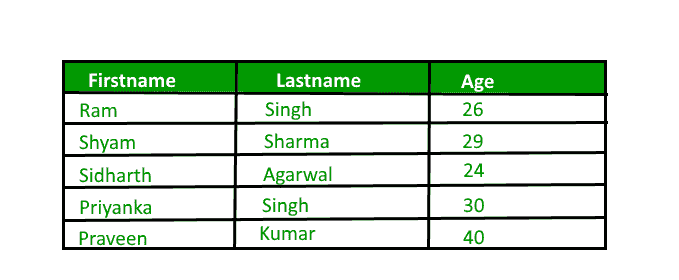
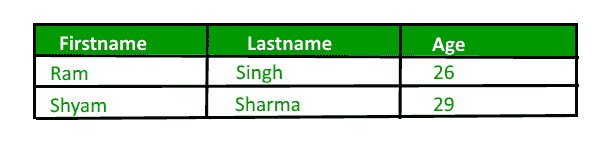

# PHP|MySQL LIMIT 子句

> Original: [https://www.geeksforgeeks.org/php-mysql-limit-clause/](https://www.geeksforgeeks.org/php-mysql-limit-clause/)

在 MySQL 中，**LIMIT**子句与 SELECT 语句一起使用，以限制结果集中的行数。 LIMIT 子句接受一个或两个参数，它们是偏移量和计数。这两个参数的值都可以是零或正整数。

**偏移量：**用于指定要返回的第一行的偏移量。
**计数：**它用于指定要返回的最大行数。

LIMIT 子句接受一个或两个参数，只要指定了两个参数，第一个参数就是偏移量，第二个参数表示计数，而只要指定一个参数，它就表示从结果集的开头返回的行数。

**语法：**

```php
SELECT column1, column2, ...
FROM table_name
LIMIT offset, count;

```

您可以在文章[MySQL|Limit 子句](https://www.geeksforgeeks.org/sql-limit-clause/)中详细了解 Limit 子句。

让我们考虑下面的表“data”，它有三列“FirstName”、“LastName”和“Age”。


要从表“data”中检索前三行，我们将使用以下查询：

```php
SELECT * FROM Data LIMIT 3;

```

要从表“DATA”中检索第 2-3 行(含)，我们将使用以下查询：

```php
SELECT * FROM Data LIMIT 1, 2;

```

下面是在过程性扩展和面向对象扩展中使用 LIMIT 子句显示表“DATA”前两行的查询的 PHP 实现：

1.  **Limit Clause using Procedural Method**

    ```php
    < ? php $link = mysqli_connect("localhost", "root", "", "Mydb");

    if ($link == = false) {
        die("ERROR: Could not connect. ".mysqli_connect_error());
    }

    $sql = "SELECT * FROM Data LIMIT 2";
    if ($res = mysqli_query($link, $sql)) {
        if (mysqli_num_rows($res) > 0) {
            echo "<table>";
            echo "<tr>";
            echo "<th>Firstname</th>";
            echo "<th>Lastname</th>";
            echo "<th>Age</th>";
            echo "</tr>";
            while ($row = mysqli_fetch_array($res)) {
                echo "<tr>";
                echo "<td>".$row['Firstname']."</td>";
                echo "<td>".$row['Lastname']."</td>";
                echo "<td>".$row['Age']."</td>";
                echo "</tr>";
            }
            echo "</table>";
            mysqli_free_result($res);
        }
        else {
            echo "No matching records are found.";
        }
    }
    else {
        echo "ERROR: Could not able to execute $sql. ".mysqli_error($link);
    }

    mysqli_close($link);
    ? >
    ```

    **输出：**
    

    **说明：**

    1.  “res”变量存储函数 mysql_query()返回的数据。
    2.  每次调用 mysqli_fetch_array()时，它都会返回 res()集中的下一行。
    3.  WHILE 循环用于遍历表“DATA”的所有行。
2.  **Limit Clause using Object Oriented Method**

    ```php
    < ? php $mysqli = new mysqli("localhost", "root", "", "Mydb");

    if ($mysqli == = false) {
        die("ERROR: Could not connect. ".$mysqli->connect_error);
    }

    $sql = "SELECT * FROM Data LIMIT 2";
    if ($res = $mysqli->query($sql)) {
        if ($res->num_rows > 0) {
            echo "<table>";
            echo "<tr>";
            echo "<th>Firstname</th>";
            echo "<th>Lastname</th>";
            echo "<th>Age</th>";
            echo "</tr>";
            while ($row = $res->fetch_array()) {
                echo "<tr>";
                echo "<td>".$row['Firstname']."</td>";
                echo "<td>".$row['Lastname']."</td>";
                echo "<td>".$row['Age']."</td>";
                echo "</tr>";
            }
            echo "</table>";
            $res->free();
        }
        else {
            echo "No matching records are found.";
        }
    }
    else {
        echo "ERROR: Could not able to execute $sql. ".$mysqli->error;
    }

    $mysqli->close();
    ? >
    ```

    **输出：**
    

3.  **Limit Clause using PDO Method**

    ```php
    < ? php try {
        $pdo = new PDO("mysql:host=localhost;dbname=Mydb", "root", "");
        $pdo->setAttribute(PDO::ATTR_ERRMODE, PDO::ERRMODE_EXCEPTION);
    }
    catch (PDOException $e) {
        die("ERROR: Could not connect. ".$e->getMessage());
    }

    try {
        $sql = "SELECT * FROM Data LIMIT 2";
        $res = $pdo->query($sql);
        if ($res->rowCount() > 0) {
            echo "<table>";
            echo "<tr>";
            echo "<th>Firstname</th>";
            echo "<th>Lastname</th>";
            echo "<th>Age</th>";
            echo "</tr>";
            while ($row = $res->fetch()) {
                echo "<tr>";
                echo "<td>".$row['Firstname']."</td>";
                echo "<td>".$row['Lastname']."</td>";
                echo "<td>".$row['Age']."</td>";
                echo "</tr>";
            }
            echo "</table>";
            unset($res);
        }
        else {
            echo "No matching records are found.";
        }
    }
    catch (PDOException $e) {
        die("ERROR: Could not able to execute $sql. ".$e->getMessage());
    }

    unset($pdo);
    ? >
    ```

    **输出：**
    