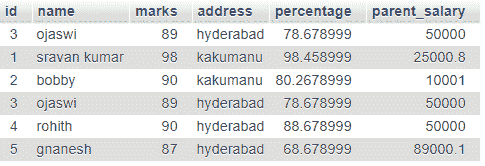

# PHP MySQL round()函数

> Original: [https://www.geeksforgeeks.org/php-mysql-round-function/](https://www.geeksforgeeks.org/php-mysql-round-function/)

在本文中，我们将了解 MySQL round()函数在 PHP 中的工作方式。 [MySQL round()函数](https://www.geeksforgeeks.org/round-function-in-mysql/)用于将一个数字舍入到个指定的小数位。 如果没有为四舍五入提供指定的小数位，则会将数字四舍五入到最接近的整数。

**语法：**

```
ROUND(X, D)
```

```
SELECT ROUND(column1), ... ROUND(column n)
from TABLE;
```

这里，我们使用学生数据库执行 round()操作。

**要求：**

*   XAMPP 服务器

PHP 是一种服务器端脚本语言，它与 MySQL 通信以管理数据库。 [<u>MySQL</u>](https://www.geeksforgeeks.org/structured-query-language/)是一个开源关系数据库管理系统(RDBMS)。 MySQL 由 Oracle Corporation 开发、分发和支持。

**数据库表屏幕截图：**



**舍入 Parent_Salary 的 MySQL 查询：**

```
SELECT parent_salary, ROUND(parent_salary) FROM student;
```

**结果：**

> 父薪：50000-四舍五入至：50000
> 父薪：10001-四舍五入至：25001
> 父薪：10001-四舍五入至：10001
> 父薪：50000-四舍五入至：50000
> 父薪：50000-四舍五入至：50000
> 父薪：89000.1-四舍五入至：89000

**舍入学生分数的 MySQL 查询：**

```
SELECT name, ROUND(percentage) FROM student;
```

**结果：**

> 学生名称：ojaswi-Percentage：79
> 学生名称：Sravan Kumar-Percentage：98
> 学生名称：Bobby-Percentage：80
> 学生名称：ojaswi-Percentage：79
> 学生名称：Rohith-Percentage：89
> 学生名称：gnanesh-Percentage：69

**接近：**

*   启动 XAMPP 服务器。
*   打开 phpMyAdmin 数据库管理器并创建名为**test**的数据库。
*   在测试数据库中创建名为**Student**的表。
*   将学生的记录插入到表格中。 要将数据插入到表中，可以使用 SQL Query，也可以直接将数据插入到表中。
*   编写 PHP 代码来执行 MySQL round()函数并获取舍入数据。

**程序：**

## PHP

```
<?php

// Store the servername in a variable
$servername = "localhost";

// Store the username in a variable
$username = "root";

//Store the password in  a variable
$password = "";

// Store the database name in a variable
$dbname = "test";

// Create connection by passing these 
// connection parameters
$conn = new mysqli($servername, 
    $username, $password, $dbname);

echo "Parent Salary";
echo "<br><br>";

// SQL Query to select the data from
// database tablr
$sql = "SELECT parent_salary, 
    ROUND(parent_salary) FROM student";

$result = $conn->query($sql);

// Display data on the web page
while($row = mysqli_fetch_array($result)){
    echo " Parent salary : " . 
        $row['parent_salary'] .
        "   =>   Round-off : " . 
        $row['ROUND(parent_salary)']
        . "<br>";
}

echo "<br>*****************************";
echo "<br>Students Percentage";
echo "<br><br>";

// SQL Query to extract data from database
$sql = "SELECT name, ROUND(percentage) FROM student";
$result = $conn->query($sql);

// Display data on the web page
while($row = mysqli_fetch_array($result)){
    echo " Student name  : ". $row['name'] .
    "   =>   Percentage : " 
    . $row['ROUND(percentage)'] . "<br>";
}

// Close the connection
$conn->close();

?>
```

发帖主题：Re：Колибри0.7.0

