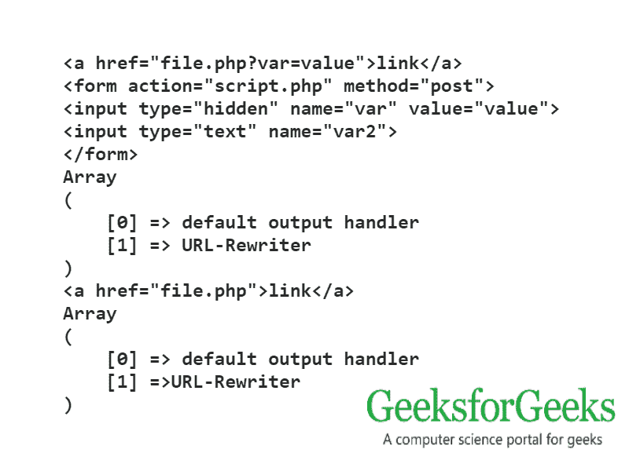
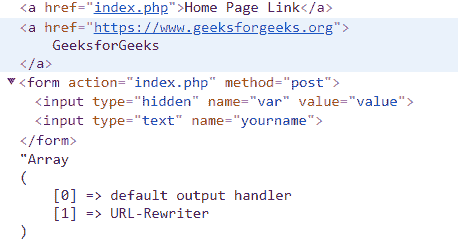

# PHP|output_add_rewrite_var()函数

> Original: [https://www.geeksforgeeks.org/php-output_add_rewrite_var-function/](https://www.geeksforgeeks.org/php-output_add_rewrite_var-function/)

**output_add_rewrite_var()函数**是 PHP 中的一个内置函数，用作输出控制函数，用于添加 URL 重写器的值。 此函数向 URL 重写机制添加另一个名称或值对。 名称和值将被添加到 URL(作为 GET 参数)和表单(作为隐藏输入字段)，其方式与使用*session.use_trans_sid*而不是会话 ID 启用透明 URL 重写的方式相同。此函数的行为由 url_rewriter.tag 和 url_rewriter.hosts php.ini 参数控制。 在进一步的版本中，使用专用输出缓冲区，*url_rewriter.tags*仅用于输出功能，增加了*url_rewriter.hosts*。

**注意：**调用 output_add_rewrite_var()函数会隐式启动输出缓冲，即使它已经处于非活动状态。

**语法：**

```
*bool* output_add_rewrite_var( *string* $name, *string* $value )
```

**参数：**

*   **$name：**它以字符串格式保存变量名。
*   **$value：**它以字符串格式保存变量的值。

**返回值：**此函数成功时返回 TRUE，失败时返回 FALSE。

下面的程序演示了 PHP 中的 output_add_rewrite_var()函数：

**程序 1：**

```
<?php

session_start();
output_add_rewrite_var('var', 'value');

echo '<a href="file.php">link</a>';

echo '<form action="script.php" method="post">
          <input type="text" name="var2" />
      </form>';

print_r(ob_list_handlers());
ob_flush();

output_reset_rewrite_vars();

echo '<a href="file.php">link</a>';
print_r(ob_list_handlers());

?>
```

**输出：**


**程序 2：**

```
<?php

output_add_rewrite_var('var', 'value');

// HTML link of web page
echo '<a href="index.php">Home Page Link</a>
<a href="https://www.geeksforgeeks.org">
    GeeksforGeeks
</a>';

// HTML form element
echo '<form action="index.php" method="post">
<input type="text" name="yourname" />
</form>';

print_r(ob_list_handlers());

?>
```

**输出：**


**引用：**[https://www.php.net/manual/en/function.output-add-rewrite-var.php](https://www.php.net/manual/en/function.output-add-rewrite-var.php)