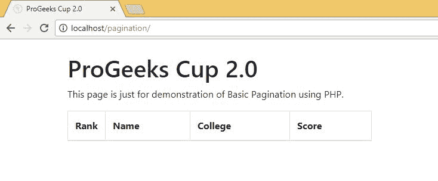
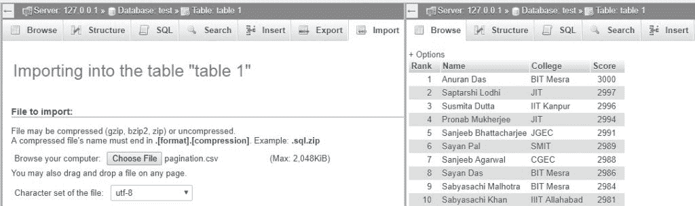

# PHP 分页|设置 1

> Original: [https://www.geeksforgeeks.org/php-pagination-set-1/](https://www.geeksforgeeks.org/php-pagination-set-1/)

[PHP](https://www.geeksforgeeks.org/php/)主要用于根据用户需求存储和显示数据库中的数据。 例如，假设我们组织了一场比赛，现在有挑战展示排行榜。 我们的活动非常成功，有一万多人参加。 现在，如果我们必须在一个页面上显示整个列表，页面将非常长，因此这可能不是显示列表的最佳方式。 我们能做的就是把整个名单分成几页。 这种在多个页面中分发单个列表的方法称为分页。 现在让我们来看看分页的优点和缺点。

**分页的缺点**

*   让我们设想一个外部观众明显较少的事件，因此，如果您发布排行榜，那么参与的少数用户可能会想要跟踪排行榜，而不是整个排行榜。 用户将倾向于看到自己的排名和排名靠前的人的表现。 因此，如果我们将排行榜分布在几个页面中，那么我们必须提供一种特殊的方式，以便用户可以导航到其用户名出现在排名列表中的页面。 在许多情况下，这似乎太多了，因此在这种情况下可以忽略分页。
*   分页是纯粹的开销，即分页是一个额外的功能，可以以无关的标记、样式以及逻辑为代价来实现。 因此，对于包含数百条记录的小数据集，使用分页通常会被忽略。

**分页的优点**

*   缺点之一是，我们知道分页本身是一种开销，但分页也可以使我们不必一次加载大量信息。 例如，让我们考虑一个应该显示大量图像的图库网页，现在在单个页面中显示数千张图片将需要数千个 HTTP 请求，这将使页面高度无响应，而使用分页，我们可以在一个页面中显示有限数量的图像，从而限制 HTTP 请求，而且还可以创建更有效的页面。
*   对于大中型项目，使用分页总是更好，因为分页不仅使网页工作更快、更高效，而且看起来更精确、更专业。

**实现分页**

现在，为了实现分页，我们首先需要一个大数据集，我们将对其应用分页。 为了简化这个小型项目，我们将使用 Bootstrap 和最小显式样式。 看到前一届 ProGeek Cup 1.0 的成功，我们将考虑制作 ProGeek Cup 2.0 的排行榜，所以让我们先从创建标记开始。
我们将尽量使整个页面保持简单，包括标题、简短描述和排行榜本身。

**标记**

在开始 PHP 的 FETCH 和 SHOW 循环之前，让我们先设置表的基本界面。 在“WWW”文件夹/“htdocs”文件夹中创建了一个文件夹并创建了一个“index.php”文件之后，我使用以下标记获得了一个基本的表格界面，如下所示。

```php
<!DOCTYPE html>
<html>
  <head>
    <title>ProGeeks Cup 2.0</title>
    <link rel="stylesheet"
     href="https://maxcdn.bootstrapcdn.com/bootstrap/4.0.0/
                                     css/bootstrap.min.css">
  </head>
  <body>
    <div class="container">
      <br>
      <div>
        <h1>ProGeeks Cup 2.0</h1>
        <p>This page is just for demonstration of Basic 
           Pagination using PHP.
        </p>
        <table class="table table-striped table-condensed 
                                          table-bordered">
          <thead>
            <tr>
              <th width="10%">Rank</th>
              <th>Name</th>
              <th>College</th>
              <th>Score</th>
            </tr>
          </thead>
          <tbody>
          </tbody>
        </table>
      </div>
    </div>
  </body>
</html>
```

[](https://media.geeksforgeeks.org/wp-content/uploads/pagination_markup.jpg)
有关在 Bootstrap 中使用 TABLE 的详细说明，请参阅后面的文章中的[。 既然我们已经成功地开发了基本标记，那么我们就必须准备好我们的数据。](https://www.geeksforgeeks.org/bootstrap-part-3/)

**数据**

如果我们想要使用分页，我们必须有相当大量的数据在页面之间分发。 现在，您可以搜索样本数据集或创建自己的数据集。 现在为了简单起见，我使用下面的 python 脚本创建了一个要在网页上显示的假排名列表。 通过使用随机库，生成的数据不太明显，使用 CSV 格式可以直接导入到 MySQL 中。

```php
import csv, random
firstNames = ["Anuran", "Bappa", "Deep", "Dhanraj", 
              "Harsh", "Sabyasachi", "Saptarshi", 
              "Sayan", "Shubham", "Sampriti", "Susmita", 
              "Pronab", "Vaskar", "Sanjeeb", "Anirudh"]
lastNames = ["Pandit", "Das", "Bhattacharjee", "Rathi", 
             "Agarwal", "Mishra", "Garg", "Pal", "Khan", 
             "Ganguly", "Dutta", "Mukherjee", "Lodhi", 
             "Malhotra", "Gupta"]
collegeNames = ["IIT Delhi", "IIT Kharagpur", "BIT Mesra",
                "JIT", "Jadavpur University", "IIT Roorkee", 
                "KGEC", "SMIT", "EIEM", "CGEC", "JGEC", 
                "IISC Bangalore", "IIIT Allahabad", 
                "IIT Kanpur", "IIT BHU"]
dataTemplate = [['Rank', 'Name', 'College', 'Score']]

Rank, maxScore = 1, 3000
for x in xrange(1500):
    i = random.randint(0, 14)
    j = random.randint(0, 14)
    k = random.randint(0, 14)
    entry = [str(Rank), firstNames[i]+" "+lastNames[j], 
                        collegeNames[k], str(maxScore)]
    dataTemplate.append(entry)
    maxScore-= random.randint(1, 3)
    Rank+= 1

targetFile = open('pagination.csv', 'w')
with targetFile:
    writer = csv.writer(targetFile)
    writer.writerows(dataTemplate)

print "Done" 
```

在上面的代码中，我们获得了名、姓和大学名的三个列表。 我们的动机是做一份假的排名表。 我们将迭代 1500 次，每次我们将生成三个随机索引，以获得随机的名字、随机的姓氏和一所大学。 我们还将生成第四个随机整数，它将表示得分与前一个排名持有者的得分之间的差异。现在我们有了 CSV 文件，我们将转到“phpmyadmin”并导入该文件以创建一个新表。 下图解释了整个过程和结果。
[](https://media.geeksforgeeks.org/wp-content/uploads/pagination_DBsetup.jpg)

现在我们已经建立了我们的数据库并完成了标记，我们基本上已经准备好了我们的主干，只需要跳到 PHP 部分本身。 根据本文的长度判断，如果我们从下一篇文章开始会更好，因为下一篇文章将完全集中在实现基本分页系统上。