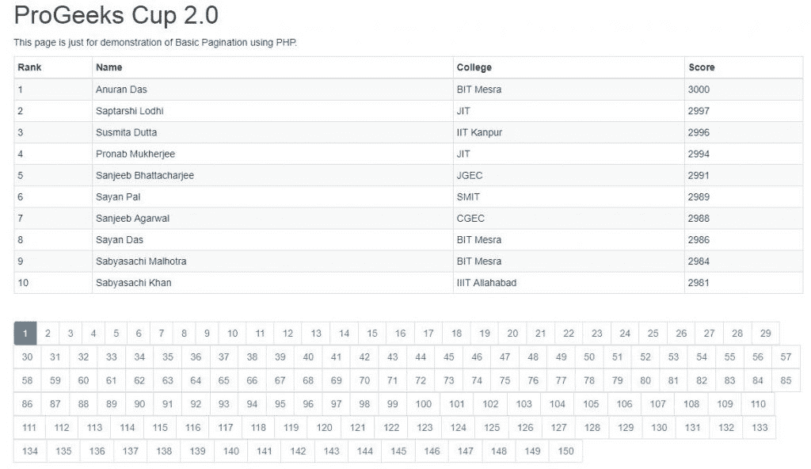

# PHP 分页|设置 2

> Original: [https://www.geeksforgeeks.org/php-pagination-set-2/](https://www.geeksforgeeks.org/php-pagination-set-2/)

在上一篇关于[PHP 分页](https://www.geeksforgeeks.org/php-pagination-set-1/)的文章中，我们了解了为什么需要分页，并开发了使用 PHP 实现分页系统的基本结构。 接下来，让我们从我们的开发过程开始，首先创建一个脚本来连接到我们的数据库。

**正在连接到数据库**

连接到数据库通常是在任何 PHP 文件中显示数据所必需的任务，因此重复编写相同的代码不是最佳方法，因此按照惯例，我们将创建一个名为“connection.php”的 PHP 文件，并将编写以下代码。

```php
<?php

// Define needed credentials.
define("HOST", "localhost");  
define("USER", 'root');  
define("PASS", 'pass1234');
define("DB", 'test');  

// Establish Connection.
$conn = mysql_connect(HOST, USER, PASS) 
        or die ('Error connecting to Database.');  
$connection = mysql_select_db(DB);  

?>
```

在本文中，我们将使用 MySQL 扩展，如果您想使用 mysqli 扩展，请参考下面的文章。 上面的代码片段只是将主机、用户名、密码和数据库名等凭据定义为 PHP 常量，并使用它们建立连接。 现在我们必须获取数据并分页分发。

**数据获取和表示**

到目前为止，我们已经创建了一个 Demo 标记，我们已经创建了 Database 表来保存假数据，我们还连接到了数据库。 现在剩下的就是获取信息行并将其显示在各个页面上。 那么，它背后的一般逻辑是什么呢？ 分页通常会限制页面中的条目数量，还会保持整个页面中所有条目的顺序。 因此，如果我们可以有一个变量来表示页面上可以显示的最大条目数，并给出一个页码，我们就可以准确地找到要显示的条目。 例如，如果当前页码是 5，限制是 10，那么我们可以手动看到，第一页将包含 1-10 个条目，第二页将包含 11-20 个条目，类似地，第五页将包含 41-50 个条目。
所以我们可以这样写：如果页码用**$pn**表示，而限制用**$limit**表示，那么条目的起始索引可以写成：**(($pn-1)*$Limit)+1**。 因为我们已经计算了关系，所以我们现在需要在“index.php”文件中实现以下内容。 以下是我们最终应该得到的。

```php
<!DOCTYPE html>
<html>
  <head>
    <title>ProGeeks Cup 2.0</title>
    <meta charset="utf-8">
    <meta name="viewport" content="width=device-width, initial-scale=1">
    <link rel="stylesheet" 
     href="https://maxcdn.bootstrapcdn.com/bootstrap/3.3.7/css/bootstrap.min.css">
  </head>
  <body>
  <?php

    // Import the file where we defined the connection to Database.  
    require_once "connection.php";

    $limit = 10;  // Number of entries to show in a page.
    // Look for a GET variable page if not found default is 1.     
    if (isset($_GET["page"])) { 
      $pn  = $_GET["page"]; 
    } 
    else { 
      $pn=1; 
    };  

    $start_from = ($pn-1) * $limit;  

    $sql = "SELECT * FROM table1 LIMIT $start_from, $limit";  
    $rs_result = mysql_query ($sql); 

  ?>
  <div class="container">
    <br>
    <div>
      <h1>ProGeeks Cup 2.0</h1>
      <p>This page is just for demonstration of 
                 Basic Pagination using PHP.</p>
      <table class="table table-striped table-condensed table-bordered">
        <thead>
        <tr>
          <th width="10%">Rank</th>
          <th>Name</th>
          <th>College</th>
          <th>Score</th>
        </tr>
        </thead>
        <tbody>
        <?php  
          while ($row = mysql_fetch_array($rs_result, MYSQL_ASSOC)) { 
                  // Display each field of the records. 
        ?>  
        <tr>  
          <td><?php echo $row["rank"]; ?></td>  
          <td><?php echo $row["name"]; ?></td>
          <td><?php echo $row["college"]; ?></td>
          <td><?php echo $row["score"]; ?></td>                                        
        </tr>  
        <?php  
        };  
        ?>  
        </tbody>
      </table>
      <ul class="pagination">
      <?php  
        $sql = "SELECT COUNT(*) FROM table1";  
        $rs_result = mysql_query($sql);  
        $row = mysql_fetch_row($rs_result);  
        $total_records = $row[0];  

        // Number of pages required.
        $total_pages = ceil($total_records / $limit);  
        $pagLink = "";                        
        for ($i=1; $i<=$total_pages; $i++) {
          if ($i==$pn) {
              $pagLink .= "<li class='active'><a href='index.php?page="
                                                .$i."'>".$i."</a></li>";
          }            
          else  {
              $pagLink .= "<li><a href='index.php?page=".$i."'>
                                                ".$i."</a></li>";  
          }
        };  
        echo $pagLink;  
      ?>
      </ul>
    </div>
  </div>
  </body>
</html>
```

如您所见，我们在前面编写的代码中添加了三个部分(突出显示的部分)来获取和显示数据以及指向下一页的链接。 让我们分别浏览所有这些部分，以深入理解代码。

**从数据库**提取

```php
// Import the file where we defined the connection to Database.  
require_once "connection.php";

$limit = 10;  // Number of entries to show in a page.
// Look for a GET variable page if not found default is 1.  
if (isset($_GET["page"])) { 
    $pn  = $_GET["page"]; 
} 
else { 
    $pn=1; 
};  

$start_from = ($pn-1) * $limit;  

$sql = "SELECT * FROM table1 LIMIT $start_from, $limit";  
$rs_result = mysql_query ($sql); 
```

在“connection.php”中创建到数据库的连接后，我们只需使用 REQUIRED_ONCE 关键字将文件导入。 接下来，我们将显式定义在单个页面中显示的最大记录数。 随后，我们检查 URL 中是否有任何“page”属性，即我们在“get”方法中查找“page”属性，如果找到，则将其设置为要显示的页码，否则为第一页或值为 1。之后，我们将计算索引以开始提取，它是使用前面推导的公式计算的，但由于 SQL 使用 0 索引，所以我们不会添加额外的 1。最后，我们只提取从索引$START_FROM 开始的记录的每个字段，并将其限制为

**显示记录**

```php
<?php
while ($row = mysql_fetch_array($rs_result, MYSQL_ASSOC)) { 
// Display each field of the records. 
?>  
  <tr>  
    <td><?php echo $row["rank"]; ?></td>  
    <td><?php echo $row["name"]; ?></td>
    <td><?php echo $row["college"]; ?></td>
    <td><?php echo $row["score"]; ?></td>                                       
  </tr>  
<?php  
 };  
?>
```

这一部分相当简单，我们只是迭代我们获取的记录，并将每行作为关联数组进行获取，我们将每个字段作为表数据(td 标记)在每个表行(tr 标记)中回显。 在每次迭代之后，我们将创建一个由四列组成的表行，即 Rank、Name、College 和 Score。

**显示页面导航**

```php
$sql = "SELECT COUNT(*) FROM table1";  
$rs_result = mysql_query($sql);  
$row = mysql_fetch_row($rs_result);  
$total_records = $row[0];  
// Number of pages required.
$total_pages = ceil($total_records / $limit);  
$pagLink = "";                      
for ($i=1; $i<=$total_pages; $i++) {
  if($i==$pn) 
    $pagLink .= "<li class='active'><a href='index.php?page=
                                    ".$i."'>".$i."</a></li>";
  else
    $pagLink .= "<li><a href='index.php?page=".$i."'>
                                        ".$i."</a></li>";  
};  
echo $pagLink;
```

这是我们需要开发导航链接以帮助用户转到不同页面的最后一节。 要做到这一点，我们首先需要知道我们的内容是在多少页中分发的。 在上面的代码中，我们首先获取总记录数，在本例中为 1500。 接下来，我们正在计算总记录除以限制的上限，该限制给出了所需的页数。 最后，每次创建一个在 URL 的“page”属性中包含页码的链接时，我们只需迭代与总页数相同的次数，如果要添加当前页面链接，我们只需添加一个 class=“active”，表示该页面是活动的。 下图是我们的最终结果。
[](https://media.geeksforgeeks.org/wp-content/uploads/pagination_simpleFinal.jpg)
我们已经使用 PHP 以过程性的方式创建了一个简单的分页系统，但是现在的问题是我们总共有 150 页，尽管功能正确，但是拥有所有这些页看起来真的很奇怪，这就是为什么在下一篇文章中我们将考虑添加更多的功能，并给我们的分页系统美化一下。