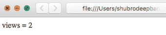
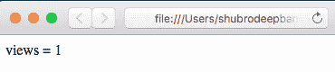

# 统计页面浏览量的 PHP 程序

> Original: [https://www.geeksforgeeks.org/php-program-count-page-views/](https://www.geeksforgeeks.org/php-program-count-page-views/)

**什么是会话？**

PHP 会话用于将数据存储在服务器上，而不是用户的计算机上。会话标识符或 SID 是唯一的数字，用于标识基于会话的环境中的每个用户。SID 用于将用户与其在服务器上的信息(如帖子、电子邮件等)联系起来。您可以在文章[PHP|Sessions](https://www.geeksforgeeks.org/php-sessions/)中了解有关会话的详细信息

**如何使用会话存储分页计数**

可以使用会话机制来存储在每次刷新时递增的页面浏览量，并在网页上显示计数。 会话是特定于用户的，对于每个用户，都会创建一个单独的会话以及与该会话相关联的单独会话变量。
使用该机制，对于每个用户，在第一次访问时，会话变量最初被设置为 1。在连续访问时，该会话变量的值递增并显示在输出网页上。

下面是存储页数的 PHP 程序：

```php
<?php 

session_start();

if(isset($_SESSION['views']))
    $_SESSION['views'] = $_SESSION['views']+1;
else
    $_SESSION['views']=1;

echo"views = ".$_SESSION['views'];

?>
```

**输出：**


**解释**
下面是上述代码的解释：

1.  **session_start()：**这是启动会话的第一步。 这是一个标准电话。 只要使用会话变量，就应该使用 SESSION_START()。
2.  **$_session[‘views’]：**这是用于存储用户会话的视图计数的会话变量。 “Views”是会话名称。 会话名称应始终包含在单引号中。
3.  **isset()：**它是一个标准的 php 函数，返回 TRUE 或 FALSE 取决于是否设置了传递的参数。

我们还可以重置会话变量。 下面的程序显示了如何在 PHP 中重置会话：

```php
<?php

session_start();
$views = $_SESSION['views']; 

unset($_SESSION['views']); 
session_destroy();

 ?>
```

**输出：**
