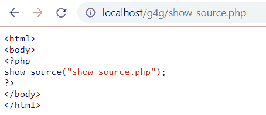
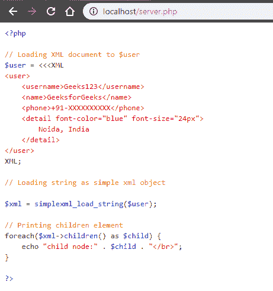

# PHP|show_source()函数

> Original: [https://www.geeksforgeeks.org/php-show_source-function/](https://www.geeksforgeeks.org/php-show_source-function/)

Show_source()函数是 PHP 中的一个内置函数，用于返回突出显示 PHP 语法的文件。 语法通过使用 HTML 标记突出显示。

**语法：**

```
show_source( $filename, $return )
```

**参数：**此函数接受上述两个参数，如下所述：

*   **$fileName：**必选参数。 它指定要显示其内容文件。
*   **$return：**可选布尔参数。 其默认值为 False。 如果设置为 true，则此函数将以字符串形式返回突出显示的代码，而不是打印出来。

**返回值：**如果设置为 true，则以字符串形式返回突出显示的代码。 它将在成功时返回 TRUE，或者在失败时返回 FALSE。

**注：**

*   此函数适用于 PHP 4.0.0 及更新版本。
*   用于突出显示 PHP 语法的颜色可以使用 ini_set()函数或在 php.ini 文件中设置。
*   使用此功能将显示整个文件，其中可能包括密码等敏感数据。

下面的程序演示了 PHP 中的 show_source()函数：

**程序 1：**下面的程序使用文件名**show_source e.php**保存文件

```
<html>
<body>
<?php
show_source("show_source.php");
?>
</body>
</html>
```

**输出：**


**程序 2：**下面的程序使用文件名**source_code.php**保存文件

```
<?php

// Loading XML document to $user
$user = <<<XML
<user>
    <username>Geeks123</username>
    <name>GeeksforGeeks</name>
    <phone>+91-XXXXXXXXXX</phone>
    <detail font-color="blue" font-size="24px">
        Noida, India
    </detail>
</user>
XML;

// Loading string as simple xml object

$xml = simplexml_load_string($user);

// Printing children element
foreach($xml->children() as $child) {
    echo "child node:" . $child . "</br>";
}

?>
```

**main.php**

```
<!DOCTYPE html>
<html>
<body>
<?php
show_source("source_code.php");
?>
</body>
</html>
```

**输出：**


**引用：**[https://www.php.net/manual/en/function.show-source.php](https://www.php.net/manual/en/function.show-source.php)