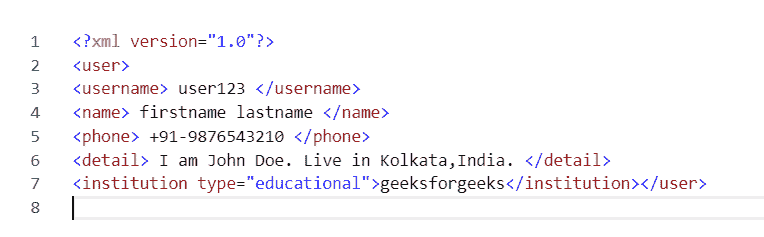

# PHP|SimpleXMLElement addAttribute()函数

> Original: [https://www.geeksforgeeks.org/php-simplexmlelement-addattribute-function/](https://www.geeksforgeeks.org/php-simplexmlelement-addattribute-function/)

**先决条件：**[阅读 XML 基础知识](https://www.geeksforgeeks.org/xml-basics/)

SimpleXMLElement：：addAttribute()函数是 PHP 中内置函数，用于在 SimpleXML 对象中添加属性。

**语法：**

```php
*void* SimpleXMLElement::addAttribute($name, $value, $namespace)
```

**参数：**此函数接受上述三个参数，如下所述：

*   **$name：**必选参数。 它指定要添加的属性的名称。
*   **$value：**可选参数。 它指定要添加的属性的值。
*   **$NAMESPACE：**可选参数。 它指定属性的命名空间。

**返回值：**此函数不接受任何参数。

**注意：**此函数适用于 PHP 5.1.3 及更高版本。

**示例：**

```php
<?php

// Loading XML document to $user
$user = <<<XML
<user>
<username> user123 </username>
<name> firstname lastname </name>
<phone> +91-9876543210 </phone>
<detail> I am John Doe. Live in Kolkata, India. </detail>
</user>
XML;

// Creating new SimpleXMLElement
// object from $user
$xml = new SimpleXMLElement($user);

// Adding child named "institution" 
// and valued "geeksforgeeks"
$xml->addChild("institution", "geeksforgeeks");

// Adding attribute named "type" and value
// "educational" in institution element.
$xml->institution->addAttribute("type", "educational");

// Printing as XML
echo $xml->asXML();
echo $xml->asXML('savexmltofile.xml');

?>
```

发帖主题：Re：Колибри0.7.0

```php
user123 firstname lastname +91-9876543210 I am John Doe.
Live in Kolkata, India. geeksforgeeks 1

```

**浏览器中的源代码：**

```php
<?xml version="1.0"?>
<user>
<username> user123 </username>
<name> firstname lastname </name>
<phone> +91-9876543210 </phone>
<detail> I am John Doe. Live in Kolkata, India. </detail>
<institution type="educational">geeksforgeeks</institution></user>
<br>1
```

**Saved XML file:**

**引用：**[https://www.php.net/manual/en/simplexmlelement.addattribute.php](https://www.php.net/manual/en/simplexmlelement.addattribute.php)