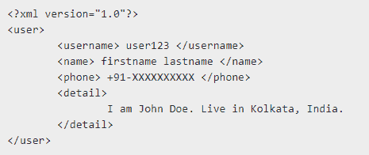

# PHP|SimpleXMLElement asXML()函数

> Original: [https://www.geeksforgeeks.org/php-simplexmlelement-asxml-function/](https://www.geeksforgeeks.org/php-simplexmlelement-asxml-function/)

**先决条件：**[读取 XML](https://www.geeksforgeeks.org/xml-basics/)

**SimpleXMLElement：：asXML()函数**是 PHP 中的一个内置函数，它从 SimpleXML 对象返回格式良好的 XML 字符串。

**语法：**

```
mixed SimpleXMLElement::asXML( $filename )
```

**参数：**此函数接受可选的单个参数*$fileName*。 它指定此函数将数据保存到文件中，而不是以 XML 形式返回。

**返回值：**如果在成功时指定，则返回表示数据和文件名的字符串；如果失败，则返回 FALSE。

**注意：**此函数适用于 PHP 5.0.1 及更新版本。

**示例 1：**

```
<?php

// Loading XML document to $user
$user = <<<XML

<user>
    <username> user123 </username>
    <name> firstname lastname </name>
    <phone> +91-XXXXXXXXXX </phone>
    <detail> 
        I am John Doe. Live in Kolkata, India.
    </detail>
</user>
XML;

// Creating new SimpleXMLElement object from $user
$xml = new SimpleXMLElement($user);

// Printing as XML
echo $xml->asXML();
echo $xml->asXML('savexmltofile.xml');

?>
```

发帖主题：Re：Колибри0.7.0

```
user123 firstname lastname +91-XXXXXXXXXX I am John Doe. Live in Kolkata, India. 1
```

**已保存的 XML 文件：**


**示例 2：**使用**sample.xml**保存 XML 文件名

```
<?xml version="1.0"?>
<user>
    <username> user123 </username>
    <name> firstname lastname </name>
    <phone> +91-XXXXXXXXXX </phone>
    <detail> 
        I am John Doe. Live in Kolkata, India.
    </detail>
</user>
```

**index.php**

```
<?php

// Loading XML document from sample.xml to
// $user and creating new SimpleXMLElement
// object
$xml = new SimpleXMLElement("sample.xml", 0, TRUE);

// Printing data as xml document
echo $xml->asXML();
echo $xml->asXML('savexmltofile.xml');

?>
```

发帖主题：Re：Колибри0.7.0

```
user123 firstname lastname +91-9876543210 I am John Doe. Live in Kolkata, India. 1
```

**已保存的 XML 文件：**
