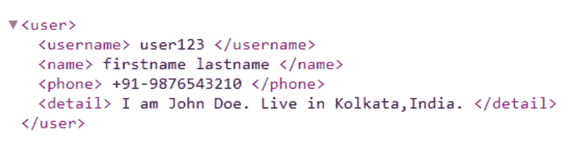

# PHP|SimpleXMLElement saveXML()函数

> Original: [https://www.geeksforgeeks.org/php-simplexmlelement-savexml-function/](https://www.geeksforgeeks.org/php-simplexmlelement-savexml-function/)

**SimpleXMLElement：：saveXML()函数**是 PHP 中内置函数，它从 SimpleXML 对象返回格式良好的 XML 字符串。 它是 SimpleXMLElement：：asXML()函数的别名。

**语法：**

```
*mixed* SimpleXMLElement::saveXML( *string* $filename )
```

**参数：**此函数接受可选的单个参数**$fileName**。 它指定此函数将数据保存到文件中，而不是以 XML 形式返回。

**返回值：**如果在成功时指定，则此函数返回表示数据和文件名的字符串，如果失败，则返回 False。

**注意：**此函数适用于 PHP 5.0.1 及更新版本。

下面的程序演示了 PHP 中的 SimpleXMLElement：：saveXML()函数：

**程序 1：**

```
<?php

// Loading XML document to $user
$user = <<<XML
<user>
    <username> user123 </username>
    <name> firstname lastname </name>
    <phone> +91-9876543210 </phone>
    <detail> I am John Doe. Live in Kolkata, India. </detail>
</user>
XML;

// Creating new SimpleXMLElement object from $user
$xml = new SimpleXMLElement($user);

// Printing as XML
echo $xml->saveXML();
echo $xml->saveXML('savexmltofile.xml');
?>
```

发帖主题：Re：Колибри0.7.0

```
user123 firstname lastname +91-9876543210 I am John Doe. Live in Kolkata, India. 1

```

**已保存的 XML 文件：**


**程序 2：**使用**sample.xml**保存 XML 文件名

```
<?xml version="1.0"?>
<user>
    <username> user123 </username>
    <name> firstname lastname </name>
    <phone> +91-9876543210 </phone>
    <detail> I am John Doe. Live in Kolkata, India. </detail>
</user>
```

**index.php**

```
<?php

// Loading XML document from sample.xml to $user
// and creating new SimpleXMLElement object
$xml = new SimpleXMLElement("sample.xml", 0, TRUE);

// Printing data as xml document
echo $xml->saveXML();
echo $xml->saveXML('savexmltofile.xml');
?>
```

发帖主题：Re：Колибри0.7.0

```
user123 firstname lastname +91-9876543210 I am John Doe. Live in Kolkata, India. 1

```

**已保存的 XML 文件：**


**引用：**[https://www.php.net/manual/en/simplexmlelement.asxml.php](https://www.php.net/manual/en/simplexmlelement.asxml.php)