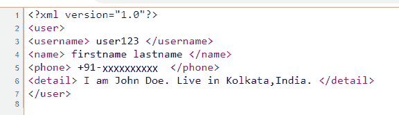

# PHP|SimpleXMLElement：：__Construct()函数

> Original: [https://www.geeksforgeeks.org/php-simplexmlelement__construct-function/](https://www.geeksforgeeks.org/php-simplexmlelement__construct-function/)

**先决条件：**[XML](https://www.geeksforgeeks.org/xml-basics/)

__struct()函数是 PHP 中的一个内置函数，用于为 XML 创建一个新的 SimpleXMLElement 对象。

**语法：**

```
SimpleXMLElement::__construct( $data, $options, $data_is_url, $namespace, $is_prefix )
```

**参数：**此函数接受上述五个参数，如下所述：

*   **$data：**必选参数。 如果$data_is_url 为 true，则它指定格式良好的 XML 字符串或指向 XML 文档文件的路径或 URL。
*   **$Options：**可选参数。 它指定了其他 Libxml 参数。 通过指定选项和 1 或 0 来设置
*   **$data_is_url：**可选参数。 其默认值为 False。 如果此参数的值为 True，则指定数据是 XML 文档文件的路径/URL，而不是字符串。
*   **$NAMESPACE：**可选参数。 它指定命名空间 URI 或前缀。
*   **$is_prefix：**布尔型可选参数。 如果 ns 是前缀，则指定 True，如果 ns 是 URI，则指定 False。 默认值为 False。

**返回值：**它返回一个表示 XML 结构化数据的 SimpleXMLElement 对象

**注意：**此函数适用于 PHP 5.0.1 及更新版本。

**示例**

```
<?php

// Loading XML document to $user
$user = <<<XML
<user>
<username> user123 </username>
<name> firstname lastname </name>
<phone> +91-XXXXXXXXXX </phone>
<detail> I am John Doe. Live in Kolkata, India. </detail>
</user>
XML;

// Creating new SimpleXMLElement
// object from $user
$xml = new SimpleXMLElement($user);

// Printing as XML
echo $xml->asXML();

?>
```

发帖主题：Re：Колибри0.7.0

```
user123 firstname lastname +91-XXXXXXXXXX I am John Doe. Live in Kolkata, India.
```

**浏览器中的输出作为源：**


**示例：**从文件或 url 加载 XML 文档。

**sample.xml**

```
<?xml version="1.0"?>
<user>
<username> user123 </username>
<name> firstname lastname </name>
<phone> +XX-XXXXXXXXXX</phone>
<detail> I am John Doe. Live in Kolkata, India. </detail>
</user>
```

**index.php**

```
<?php

// Loading XML document from sample.xml to $user
// and creating new SimpleXMLElement object
$xml = new SimpleXMLElement("sample.xml", 0, TRUE);

// Printing data as xml document
echo $xml->asXML();

?>
```

发帖主题：Re：Колибри0.7.0

```
user123 firstname lastname +91-XXXXXXXXXX I am John Doe. Live in Kolkata, India.
```

**浏览器中的输出作为源：**


参数$OPTION 的可能值为：

*   LIBXML_COMPACT-节点分配优化已激活
*   LIBXML_DTDATTR-此选项设置默认 DTD 属性
*   LIBXML_DTDLOAD-从外部加载子集
*   LIBXML_DTDVALID-使用 DTD 验证 XML 文档
*   LIBXML_DITED_VERSION-将 libxml 版本点分隔
*   LIBXML_ERR_ERROR-获取错误(可恢复)
*   LIBXML_ERR_FATAL-获取错误(致命)
*   LIBXML_ERR_NONE-无错误
*   LIBXML_ERR_WARNING-获取警告(简单)
*   LIBXML_NOBLANKS-删除 XML 文档中的所有空白节点
*   LIBXML_NOCDATA-将新 CDATA 合并为文本节点
*   LIBXML_NOEMPTYTAG-展开空标记
*   LIBXML_NOENT-替换 XML 文档中的实体
*   LIBXML_NOERROR-限制错误报告
*   LIBXML_NONET-在加载 XML 文档时禁用网络访问
*   LIBXML_NOWARNING-限制警告报告
*   LIBXML_NOXMLDECL-保存文档时删除 XML 声明
*   LIBXML_NSCLEAN-删除所有冗余的命名空间声明
*   LIBXML_PARSEHUGE-设置 XML_PARSE_GUGGE 标志，该标志从解析器中移除任何硬编码限制，这将再次影响文本节点大小和文档最大深度等限制
*   LIBXML_XINCLUDE-替换实现 XInclude
*   LIBXML_VERSION-获取整数格式的 LIBXML 版本

**引用：**[https://www.php.net/manual/en/simplexmlelement.construct.php](https://www.php.net/manual/en/simplexmlelement.construct.php)