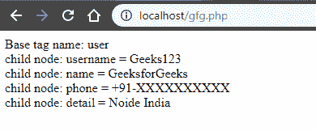
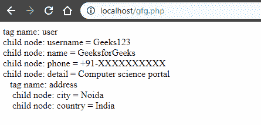

# PHP|SimpleXMLElement：：getName()函数

> Original: [https://www.geeksforgeeks.org/php-simplexmlelementgetname-function/](https://www.geeksforgeeks.org/php-simplexmlelementgetname-function/)

**先决条件：**[阅读 XML 基础知识](https://www.geeksforgeeks.org/xml-basics/)
SimpleXMLElement：：getName()函数是 PHP 中的一个内置函数，它返回 XML 元素的名称。
**语法：**和

```php
*string* SimpleXMLElement::getName( void )
```

**参数：**此函数不接受任何参数。
**返回值：**它返回一个字符串，表示 SimpleXMLElement 对象的 XML 元素的名称。
**注意：**PHP 5.1.3 及更高版本提供此函数。
以下程序说明 PHP：
**示例 1：**和
中的 SimpleXMLElement：：getName()函数

## PHP

```php
<?php

// Loading XML document to $user
$user = <<<XML
<user>
    <username>Geeks123 </username>
    <name>GeeksforGeeks</name>
    <phone>+91-XXXXXXXXXX</phone>
    <detail font-color="blue" font-size="24px">
        Noide India
    </detail>
</user>
XML;

// Loading string as simple xml object
$xml = simplexml_load_string($user);

// Display the name of element
echo "Base tag name: " . $xml->getName() . "<br>";

foreach($xml->children() as $child) {
    echo "child node: " . $child->getName()
        . " = " . $child . "</br>";
}

?>
```

发帖主题：Re：Колибри0.7.8.0



**示例 2：**和

## PHP

```php
<?php

// Loading XML document to $user
$user = <<<XML
<user>
    <username>Geeks123</username>
    <name>GeeksforGeeks</name>
    <phone>+91-XXXXXXXXXX</phone>
    <detail font-color="blue" font-size="24px">
        Computer science portal
    </detail>
    <address>
        <city>Noida</city>
        <country>India</country>
    </address>
</user>
XML;

// Loading string as simple xml object
$xml = simplexml_load_string($user);

// Recursive function called
getname_rec($xml, 0);

// The getname_rec() function definition
function getname_rec($xml, $depth) {

    print_space($depth);

    echo "tag name: " . $xml->getName() . "<br>";

    foreach($xml->children() as $child) {
        if($child->count() > 0) {

            // If there exists any child of current node
            getname_rec($child, $depth+1);
        }
        else {

            // If there is no child of the current node
            print_space($depth);
            echo " child node: " . $child->getName()
                    . " = " . $child . "</br>";
        }
    }
}

// Function to print 3X$i number of spaces
function print_space($i) {
    for($x = 0; $x < $i*3; $x++) {
        echo " ";
    }
}

?>
```

发帖主题：Re：Колибри0.7.8.0



**引用：**[https://www.php.net/manual/en/simplexmlelement.getname.php](https://www.php.net/manual/en/simplexmlelement.getname.php)