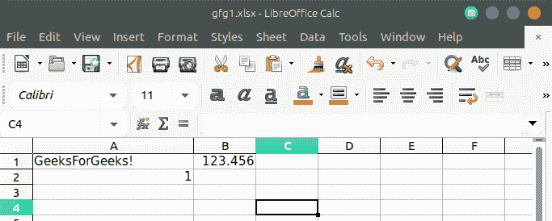
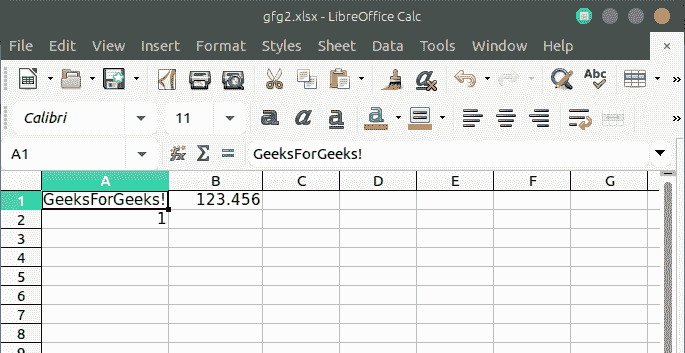

# PHP|电子表格|通过坐标

设置单元格值

> Original: [https://www.geeksforgeeks.org/php-spreadsheet-setting-a-cell-value-by-coordinate/](https://www.geeksforgeeks.org/php-spreadsheet-setting-a-cell-value-by-coordinate/)

SetCellValue()函数是 PHPSpreadsheet 中的内置函数，用于设置电子表格中单元格的值。

**语法：**

```
setCellValue( $coordinate, $value )
```

**参数：**此函数接受上述两个参数，如下所述：

*   **$COLISTRATE：**该参数用于存储 EXCEL 表的坐标值。
*   **$VALUE：**此参数用于存储要在 Excel 表格中设置的数据值。

**返回值：**此函数返回 PhpOffice\PhpSpreadsheet\Worksheet\Worksheet 类的对象。

**示例 1：**

## PHP

```
<?php

// require_once('path/vendor/autoload.php');
use PhpOffice\PhpSpreadsheet\Spreadsheet;
use PhpOffice\PhpSpreadsheet\Writer\Xlsx;

// Creates New Spreadsheet
$spreadsheet = new Spreadsheet();

// Retrieve the current active worksheet
$sheet = $spreadsheet->getActiveSheet();

// Sets cell A1 with String Value
$sheet->setCellValue('A1', 'GeeksForGeeks!');

// Sets cell A2 with Boolean Value
$sheet->setCellValue('A2', TRUE);

// Sets cell B1 with Numeric Value
$sheet->setCellValue('B1', 123.456);

// Write an .xlsx file
$writer = new Xlsx($spreadsheet);

// Save .xlsx file to the current directory
$writer->save('gfg1.xlsx');
?>
```

发帖主题：Re：Колибри0.7.0



或者，也可以通过首先检索单元格对象然后设置值来实现。 为此，可以借助*getCell()*函数检索 Cell 对象，然后借助*setValue()*函数设置值。

**语法：**

```
$spreadsheet->getActiveSheet()->getCell($coordinate)->setValue($value);
```

**示例 2：**

## PHP

```
<?php

// require_once('vendor/autoload.php');
use PhpOffice\PhpSpreadsheet\Spreadsheet;
use PhpOffice\PhpSpreadsheet\Writer\Xlsx;

// Creates New Spreadsheet
$spreadsheet = new Spreadsheet();

// Retrieve the current active worksheet
$sheet = $spreadsheet->getActiveSheet();

// Sets cell A1 with String Value
$sheet->getCell('A1')->setValue('GeeksForGeeks!');

// Sets cell A2 with Boolean Value
$sheet->getCell('A2')->setValue(TRUE);

// Sets cell B1 with Numeric Value
$sheet->getCell('B1')->setValue(123.456);

// Write an .xlsx file
$writer = new Xlsx($spreadsheet);

// Save .xlsx file to the current directory
$writer->save('gfg2.xlsx');
?>
```

发帖主题：Re：Колибри0.7.0



**引用：**[https://phpspreadsheet.readthedocs.io/en/develop/topics/accessing-cells/](https://phpspreadsheet.readthedocs.io/en/develop/topics/accessing-cells/)