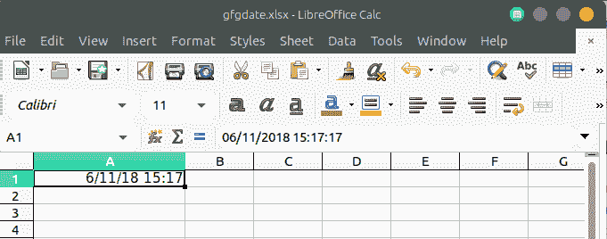

# PHP|电子表格|在单元格中设置日期和/或时间值

> Original: [https://www.geeksforgeeks.org/php-spreadsheet-setting-a-date-and-or-time-value-in-a-cell/](https://www.geeksforgeeks.org/php-spreadsheet-setting-a-date-and-or-time-value-in-a-cell/)

在 PHP 电子表格中，日期或时间值以时间戳的形式存储在 Excel 表格中，时间戳是一个浮点值。 因此，为了以人类可读的格式存储日期/时间，需要计算正确的 Excel 时间戳，并最终设置数字格式掩码。

**示例：**

```
<?php

// PHP program to set a date time value in excel sheet
require_once('vendor/autoload.php');

use PhpOffice\PhpSpreadsheet\Spreadsheet;
use PhpOffice\PhpSpreadsheet\Writer\Xlsx;

// Creates New Spreadsheet
$spreadsheet = new Spreadsheet(); 

// Retrieve the current active worksheet
$sheet = $spreadsheet->getActiveSheet(); 

// Set the number format mask so that the excel timestamp 
// will be displayed as a human-readable date/time
$spreadsheet->getActiveSheet()->getStyle('A1')
    ->getNumberFormat()
    ->setFormatCode(
    \PhpOffice\PhpSpreadsheet\Style\NumberFormat::FORMAT_DATE_DATETIME
    );

// Get current date and timestamp
// Convert to an Excel date/time
$dateTime = time(); 
$excelDateValue = \PhpOffice\PhpSpreadsheet\Shared\Date::PHPToExcel(
                  $dateTime ); 

// Set cell A1 with the Formatted date/time value
$sheet->setCellValue('A1',$excelDateValue);

// Write an .xlsx file 
$writer = new Xlsx($spreadsheet);

// Save .xlsx file to the current directory
$writer->save('gfgdate.xlsx');
?>
```

**输出：**


**引用：**[https://phpspreadsheet.readthedocs.io/en/develop/topics/accessing-cells/](https://phpspreadsheet.readthedocs.io/en/develop/topics/accessing-cells/)