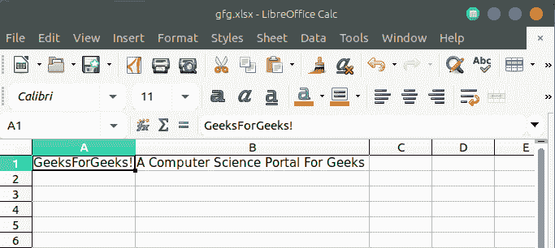

# PHP|电子表格

> Original: [https://www.geeksforgeeks.org/php-spreadsheet/](https://www.geeksforgeeks.org/php-spreadsheet/)

**简介：**PHPSpreadsheet 是一个用 PHP 编写的库，它借助一组给定的类来帮助读取和写入不同类型的电子表格文件格式。 支持电子表格各种格式有 Excel(.xlsx)、Open Document Format(.ods)、SpreadsheetML(.xml)、CSV 等。

**优点：**

*   简单有效的比较。
*   强大的海量数据分析能力。

**可用性：**

*   议程
*   预算
*   日历 / 历法 / 日程表 / 名单
*   卡片
*   图表和图表
*   金融工具(贷款计算器等)
*   传单
*   形状 / 种类 / 方式 / 表格
*   存货清单 / 存货盘存 / 财产目录 / 建筑物内部部件清单
*   发票
*   清单和待办事项清单
*   规划师
*   计划和建议
*   汇报 / 爆炸声 / 报道 / 报告
*   将…列入计划表 / 安排 / 排定 / 编制目录
*   时间表

**要求：**以下软件使用 PHPS 电子表格开发：

*   PHP 版本**5.6 或更新版本**
*   PHP 扩展**php_zip**已启用
*   PHP 扩展**php_xml**已启用
*   PHP 扩展**php_GD2**已启用

**安装：**PHPS 电子表格可以在[Composer](https://getcomposer.org)的帮助下安装

**在终端上：**在终端上运行以下命令以安装 PHPSpreadsheet：

```
composer require phpoffice/phpspreadsheet
```

**示例 1：**

## PHP

```
<?php

// require_once('vendor/autoload.php');
use PhpOffice\PhpSpreadsheet\Spreadsheet;
use PhpOffice\PhpSpreadsheet\Writer\Xlsx;

// Creates New Spreadsheet
$spreadsheet = new Spreadsheet();

// Retrieve the current active worksheet
$sheet = $spreadsheet->getActiveSheet();

// Set the value of cell A1
$sheet->setCellValue('A1', 'GeeksForGeeks!');

// Sets the value of cell B1
$sheet->setCellValue('B1', 'A Computer Science Portal For Geeks');

// Write an .xlsx file
$writer = new Xlsx($spreadsheet);

// Save .xlsx file to the current directory
$writer->save('gfg.xlsx');
?>
```

发帖主题：Re：Колибри0.7.0



**示例 2：**

## PHP

```
<?php

// require_once('path/vendor/autoload.php');
// Load an .xlsx file
$spreadsheet = \PhpOffice\PhpSpreadsheet\IOFactory::load('gfg.xlsx');

// Store data from the activeSheet to the variable
// in the form of Array

$data = array(1,$spreadsheet->getActiveSheet()
            ->toArray(null,true,true,true));

// Display the sheet content
var_dump($data);
?>
```

发帖主题：Re：Колибри0.7.0

```
array(2) { 
    [0]=> int(1) 
    [1]=> array(1) { 
        [1]=> array(2) {
            ["A"]=> string(14) "GeeksForGeeks!" 
            ["B"]=> string(35) "A Computer Science Portal For Geeks"
        } 
    }
}
```

**引用：**[https://phpspreadsheet.readthedocs.io/en/develop/](https://phpspreadsheet.readthedocs.io/en/develop/)