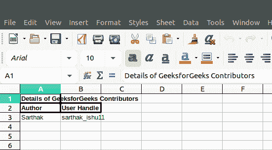
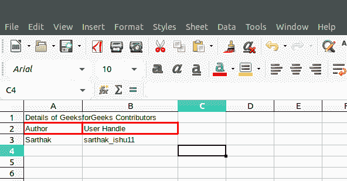

# PHP|Spreadsheet_Excel_Writer|addWorksheet()函数

> Original: [https://www.geeksforgeeks.org/php-spreadsheet_excel_writer-addworksheet-function/](https://www.geeksforgeeks.org/php-spreadsheet_excel_writer-addworksheet-function/)

AddWorksheet()函数是 PHP|Spreadsheet_Excel_Writer 中的内置函数，用于向 Excel 工作簿添加新工作表。

**语法：**

```
Workbook::&addWorksheet( $name='' )
```

**参数：**此函数接受单个参数*$string*作为工作表名称，该名称不能超过 31 个字符。

**返回值：**此函数成功时返回对工作表对象的引用，失败时返回 PEAR_ERROR。

**示例 1：**

## PHP

```
<?php

require_once 'Spreadsheet/Excel/Writer.php';

// Add Workbook
$workbook = new Spreadsheet_Excel_Writer();

// Add Format to spreadsheet
$format_bold =& $workbook->addFormat();

// Set Bold Format
$format_bold->setBold();

// Add Worksheet to Spreadsheet
$worksheet =& $workbook->addWorksheet();

$format_bold->setBorder(2);

// Write to Worksheet
$worksheet->write(0, 0, "Details of GeeksforGeeks
                      Contributors", $format_bold);
$worksheet->write(1, 0, "Author", $format_bold);
$worksheet->write(1, 1, "User Handle", $format_bold);
$worksheet->write(2, 0, "Sarthak");
$worksheet->write(2, 1, "sarthak_ishu11");

// Send .xlsx file to header
$workbook->send('test.xls');

// Close Workbook Object
$workbook->close();
?>
```

发帖主题：Re：Колибри0.7.0



**示例 2：**

## PHP

```
<?php

require_once 'Spreadsheet/Excel/Writer.php';

// Add Workbook
$workbook = new Spreadsheet_Excel_Writer();

// Add Format to spreadsheet
$format_border =& $workbook->addFormat();

// Add Worksheet to Spreadsheet
$worksheet =& $workbook->addWorksheet();

// Set and Add Border Width
$format_border->setBorder(2);

// Set and Add Color to Border
$format_border->setBorderColor('red');

// Write to Worksheet
$worksheet->write(0, 0, "Details of GeeksforGeeks
                     Contributors", $format_bold);
$worksheet->write(1, 0, "Author", $format_border);
$worksheet->write(1, 1, "User Handle", $format_border);
$worksheet->write(2, 0, "Sarthak");
$worksheet->write(2, 1, "sarthak_ishu11");

// Send .xlsx file to header
$workbook->send('test.xls');

// Close Workbook Object
$workbook->close();
?>
```

发帖主题：Re：Колибри0.7.0



**引用：**[https://pear.php.net/manual/en/package.fileformats.spreadsheet-excel-writer.spreadsheet-excel-writer-workbook.addworksheet.php](https://pear.php.net/manual/en/package.fileformats.spreadsheet-excel-writer.spreadsheet-excel-writer-workbook.addworksheet.php)