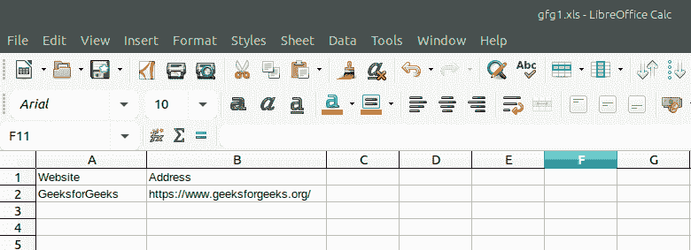

# PHP|Spreadsheet_Excel_Writer|简介

> Original: [https://www.geeksforgeeks.org/php-spreadsheet_excel_writer-introduction/](https://www.geeksforgeeks.org/php-spreadsheet_excel_writer-introduction/)

**简介：**Spreadsheet_Excel_Writer 是一个用 PHP 编写的库，它借助一组给定的类来帮助读取和写入不同类型的电子表格文件格式。

**优点：**

*   简单有效的比较。
*   强大的海量数据分析能力。
*   以电子表格的形式拆分出大量(或不是很大)信息，这很容易使用相当普遍的电子表格程序(如 Excel(或 OpenOffice))进行操作。

**安装(Composer)：**

```php
composer require pear/spreadsheet_excel_writer
```

**用法：**

```php
<?php

// require_once 'Spreadsheet/Excel/Writer.php';

// Creating a workbook
$workbook = new Spreadsheet_Excel_Writer();

// Sending HTTP headers
$workbook->send('gfg1.xls');

// Creating a worksheet
$worksheet =& $workbook->addWorksheet('1st Worksheet');

// The actual data
$worksheet->write(0, 0, 'Website');
$worksheet->write(0, 1, 'Address');
$worksheet->write(1, 0, 'GeeksforGeeks');
$worksheet->write(1, 1, 'https://www.geeksforgeeks.org/');

// Let's send the file
$workbook->close();
?>
```

**输出：**


**引用：**[https://pear.php.net/manual/en/package.fileformats.spreadsheet-excel-writer.intro.php](https://pear.php.net/manual/en/package.fileformats.spreadsheet-excel-writer.intro.php)