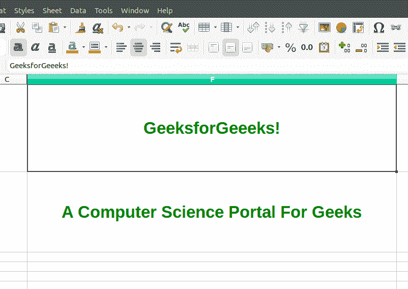

# PHP|Spreadsheet_Excel_Writer|setAlign()函数

> Original: [https://www.geeksforgeeks.org/php-spreadsheet_excel_writer-setalign-function/](https://www.geeksforgeeks.org/php-spreadsheet_excel_writer-setalign-function/)

SetAlign()函数是 PHP|Spreadsheet_Excel_Writer 中的内置函数，用于设置电子表格的单元格对齐方式。

**语法：**

```
*void* Format::setAlign( $location )
```

**参数：**此函数接受采用位置的单个参数*$location*作为水平对齐(左、中、右、填充、对齐、合并、相等 _ 空格)和垂直对齐(上、vCenter、下、vJUSTY、vequence_space)。 若要实现水平对齐和垂直对齐的组合，请调用此方法两次。

**返回值：**此函数成功时返回 TRUE，失败时返回 PEAR_ERROR。

**示例 1：**

```
<?php

// require_once 'Spreadsheet/Excel/Writer.php';

// Add object of class Spreadsheet_Excel_Writer
$workbook = new Spreadsheet_Excel_Writer();
$worksheet =& $workbook->addWorksheet();

// Add format to the workbook
$format_align =& $workbook->addFormat();

// Set color for the text 
$format_align->setColor ('green');

// Set alignment of text to the center of the cell 
$format_align->setAlign('center');

// Set alignment of text to the center 
// from the top of the cell 
$format_align->setAlign('vcenter');

// Add boldness to the text 
$format_align->setBold(1);

// Set size of the text
$format_align->setSize(25);

// Add data to the cell
$worksheet->write(0, 5, 'GeeksforGeeeks!', $format_align);
$worksheet->write(1, 5, 'A Computer Science Portal For Geeks',
                  $format_align);

// Send file to the browser
$workbook->send('test.xlsx');

// Free the memory
$workbook->close();
?>
```

**输出：**


**示例 2：**

```
<?php

// require_once 'Spreadsheet/Excel/Writer.php';

// Add object of class Spreadsheet_Excel_Writer
$workbook = new Spreadsheet_Excel_Writer();
$worksheet =& $workbook->addWorksheet();

// Add Format to the workbook
$format_align =& $workbook->addFormat();

// Set Color for the text 
$format_align->setColor ('white');

// Set Alignment of text to the top of the cell 
$format_align->setAlign('top');

// Set Alignment of text to the right of the cell 
$format_align->setAlign('right');

// Set background color
$format_align->setBgColor('black');

// Set Pattern to the cell
$format_align->setPattern(1);

// Add Boldness to the text 
$format_center->setItalic(1);

// Set Size of the text
$format_align->setSize(20);

// Add data to the cell
$worksheet->write(7, 5, 'Sarthak Prajapati', $format_align);
$worksheet->write(8, 5, 'sarthak_ishu11', $format_align);
$worksheet->write(9, 5, 'Chandigarh', $format_align);

// Send file to the browser
$workbook->send('test.xlsx');

// Free the memory
$workbook->close();
?>
```

**输出：**


**引用：**[https://pear.php.net/manual/en/package.fileformats.spreadsheet-excel-writer.spreadsheet-excel-writer-format.setalign.php](https://pear.php.net/manual/en/package.fileformats.spreadsheet-excel-writer.spreadsheet-excel-writer-format.setalign.php)