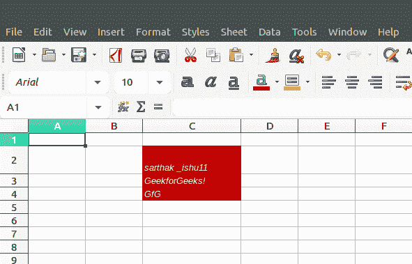

# PHP|Spreadsheet_Excel_Writer|setBgColor()函数

> Original: [https://www.geeksforgeeks.org/php-spreadsheet_excel_writer-setbgcolor-function/](https://www.geeksforgeeks.org/php-spreadsheet_excel_writer-setbgcolor-function/)

SetBgColor()函数是 PHP|Spreadsheet_Excel_Writer 中的内置函数，用于设置电子表格单元格的背景色。 要使用此函数，请使用 setPattern 函数。

**语法：**

```php
*void* Format::setBgColor( $color )
```

**参数：**此函数接受单个参数*$color*，该参数将颜色值作为字符串，如‘red’、‘green’，另一种方法是指定介于 8 到 63 之间的颜色值。

**返回值：**此函数成功时返回 TRUE，失败时返回 PEAR_ERROR。

**示例 1：**

```php
<?php

require_once 'Spreadsheet/Excel/Writer.php';

// Create Spreadsheet Excel Writer Object 
$workbook = new Spreadsheet_Excel_Writer();

// Add Worksheet 
$worksheet =& $workbook->addWorksheet('testing bg color');

// Specify the height of the cell by using setRow function
$worksheet->setRow(1, 20);

// Add Format to the cell
$format_BgColor =& $workbook->addFormat();

// Set the background color 
$format_BgColor->setBgColor('red');

// Add Italic Font to the text
$format_BgColor->setItalic();

// Set the pattern
$format_BgColor->setPattern(4);

// Add data to the cell 
$worksheet->write(1, 2, 'sarthak _ishu11', $format_BgColor);
$worksheet->write(2, 2, 'GeekforGeeks!', $format_BgColor);
$worksheet->write(3, 2, 'GfG', $format_BgColor);

// Send file to the browser
$workbook->send('test.xls');

// Close the file
$workbook->close();
?>
```

**输出：**


**示例 2：**

```php
<?php
require_once 'Spreadsheet/Excel/Writer.php';

// Create Spreadsheet_Excel_Writer Object
$workbook = new Spreadsheet_Excel_Writer();

// Add Worksheet
$worksheet =& $workbook->addWorksheet();

// Set Font Family Times New Roman 
$format_setBgColor =& $workbook->addFormat();
$format_setBgColor->setFontFamily('Times New Roman');

// Set Italic Property
$format_setBgColor->setItalic();

// Set Shadow to text
$format_setBgColor->setShadow();

// Set the background color 
$format_setBgColor->setBgColor('yellow');

// Set the pattern
$format_setBgColor->setPattern(4);

// Write to Worksheet
$worksheet->write(0, 0, "Information", $format_setBgColor);
$worksheet->write(1, 0, "Website Name", $format_setBgColor);
$worksheet->write(1, 1, "Address", $format_setBgColor);
$worksheet->write(2, 0, "GeeksforGeeks", $format_setItalic);
$worksheet->write(2, 1, "https://www.geeksforgeeks.org/", 
                                      $format_setItalic);
$workbook->send('test.xls');

$workbook->close();
?> 
```

**输出：**


**引用：**[https://pear.php.net/manual/en/package.fileformats.spreadsheet-excel-writer.spreadsheet-excel-writer-format.setbgcolor.php](https://pear.php.net/manual/en/package.fileformats.spreadsheet-excel-writer.spreadsheet-excel-writer-format.setbgcolor.php)