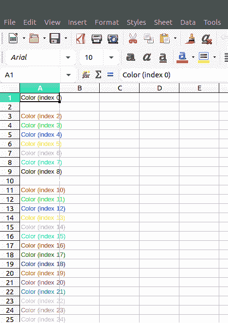
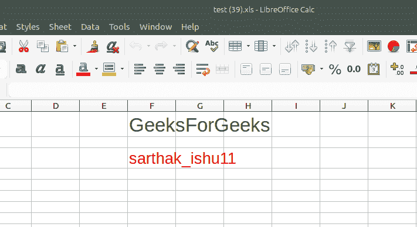

# PHP|Spreadsheet_Excel_Writer|setColor()函数

> Original: [https://www.geeksforgeeks.org/php-spreadsheet_excel_writer-setcolor-function/](https://www.geeksforgeeks.org/php-spreadsheet_excel_writer-setcolor-function/)

SetColor()函数是 PHP|Spreadsheet_Excel_Writer 中的内置函数，用于设置单元格内容的颜色。

**语法：**

```
*void* Format::setColor( mixed $color )
```

**参数：**此函数接受单个参数*$color*，它将颜色值作为字符串，如‘green’或从 0 到 64 的值。

**返回值：**此函数成功时返回 TRUE，失败时返回 PEAR_ERROR。

**示例 1：**

```
<?php

// require_once 'Spreadsheet/Excel/Writer.php';

// Create Spreadsheet_Excel_Writer Object
$workbook  = new Spreadsheet_Excel_Writer();

// Add worksheet
$worksheet = &$workbook->addWorksheet('SetColor');

for ($inc = 0; $inc < 64; $inc++) {

    // Sets the color of a cell's content
    $format = $workbook->addFormat();
    $format->setColor($inc);
    $worksheet->write($inc, 0, 'Color (index '.$inc.')', $format);
}

// Send file to browser
$workbook->send('setColor.xls');

// Close workbook
$workbook->close();
?>
```

**输出：**


**示例 2：**

```
<?php

require_once 'Spreadsheet/Excel/Writer.php';

// Create Spreadsheet_Excel_Writer Object
$workbook  = new Spreadsheet_Excel_Writer();

// Add worksheet
$worksheet = &$workbook->addWorksheet('SetColor');

// Sets the color of a cell's content
$format = $workbook->addFormat();

// Set color to the text
$format->setColor(17);

// Set the size of text
$format->setSize(25);

// Add text to the excel
$worksheet->write(0, 5, 'GeeksForGeeks', $format);

// Sets the color of a cell's content
$format1 = $workbook->addFormat();

// Set color to the cell
$format1->setColor(2);

// Set the size of the text
$format1->setSize(20);

// Add text to the excel sheet
$worksheet->write(2, 5, 'sarthak_ishu11', $format1);

// Send file to browser
$workbook->send('test.xls');

// Close workbook
$workbook->close();
?>
```

**输出：**


**引用：**[https://pear.php.net/manual/en/package.fileformats.spreadsheet-excel-writer.spreadsheet-excel-writer-format.setcolor.php](https://pear.php.net/manual/en/package.fileformats.spreadsheet-excel-writer.spreadsheet-excel-writer-format.setcolor.php)