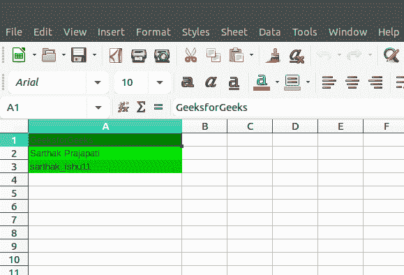
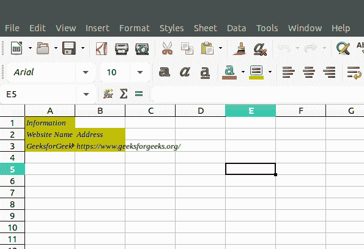

# PHP|Spreadsheet_Excel_Writer|setFgColor()函数

> Original: [https://www.geeksforgeeks.org/php-spreadsheet_excel_writer-setfgcolor-function/](https://www.geeksforgeeks.org/php-spreadsheet_excel_writer-setfgcolor-function/)

SetFgColor()函数是 PHP|Spreadsheet_Excel_Writer 中的内置函数，用于设置电子表格单元格的前景色。 要使用此函数，请使用 setPattern 函数。 这里，“前景”指的是单元格背景的顶层。

**语法：**

```php
*void* Format::setFgColor( $color )
```

**参数：**此函数接受单个参数*$color*，该参数将颜色值作为字符串，如‘red’，‘green’，以及通过指定 8 到 63 之间的颜色代码的另一种方法。

**返回值：**此函数成功时返回 TRUE，失败时返回 PEAR_ERROR。

**示例 1：**

```php
<?php

require_once 'Spreadsheet/Excel/Writer.php';

// Create Spreadsheet Excel Writer Object
$workbook = new Spreadsheet_Excel_Writer();

// Add Worksheet to the spreadsheet
$worksheet =& $workbook->addWorksheet();

// Add "regular" green to the cell
$format_regular_green =& $workbook->addFormat();
$format_regular_green->setFgColor('green');

// Add "special" green to the cell
$format_special_green =& $workbook->addFormat();
$format_special_green->setFgColor(11);

// Set Custom Green Color
$workbook->setCustomColor(12, 10, 200, 10);
$format_our_green =& $workbook->addFormat();
$format_our_green->setFgColor(12);

// Set Column width
$worksheet->setColumn(0, 0, 30);

// Add data to the spreadsheet 
$worksheet->write(0, 0, "GeeksforGeeks", $format_regular_green);
$worksheet->write(1, 0, "Sarthak Prajapati", $format_special_green);
$worksheet->write(2, 0, "sarthak_ishu11", $format_our_green);

// Send file to the browser
$workbook->send('setFgColor.xls');

// Close the file 
$workbook->close();
?>
```

**输出：**


**示例 2：**

```php
<?php

require_once 'Spreadsheet/Excel/Writer.php';

// Create Spreadsheet_Excel_Writer Object
$workbook = new Spreadsheet_Excel_Writer();

// Add Worksheet
$worksheet =& $workbook->addWorksheet();

// Set Font Family Times New Roman 
$format_setFgColor =& $workbook->addFormat();
$format_setFgColor->setFontFamily('Times New Roman');

// Set Italic Property
$format_setFgColor->setItalic();

// Set Shadow to text
$format_setFgColor->setShadow();

// Set the foreground color 
$format_setFgColor->setBgColor('yellow');

// Set the pattern
$format_setFgColor->setPattern(4);

// Write to Worksheet
$worksheet->write(0, 0, "Information", $format_setFgColor);
$worksheet->write(1, 0, "Website Name", $format_setFgColor);
$worksheet->write(1, 1, "Address", $format_setFgColor);
$worksheet->write(2, 0, "GeeksforGeeks", $format_setFgColor);
$worksheet->write(2, 1, "https://www.geeksforgeeks.org/", $format_setFgColor);
$workbook->send('test.xls');

$workbook->close();
?> 
```

**输出：**


**引用：**[https://pear.php.net/manual/en/package.fileformats.spreadsheet-excel-writer.spreadsheet-excel-writer-format.setfgcolor.php](https://pear.php.net/manual/en/package.fileformats.spreadsheet-excel-writer.spreadsheet-excel-writer-format.setfgcolor.php)