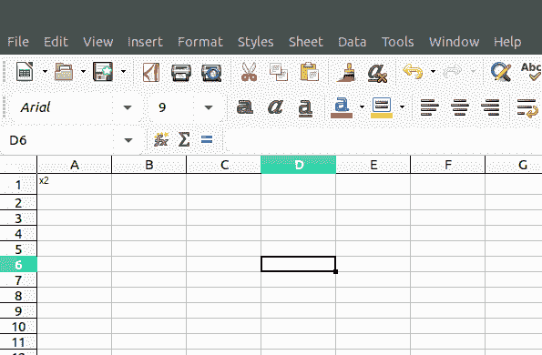
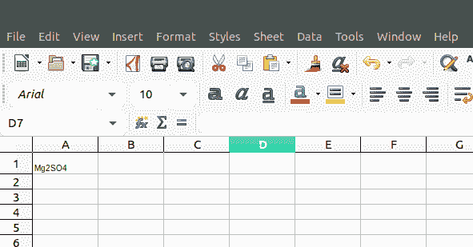

# PHP|Spreadsheet_Excel_Writer|setScript()函数

> Original: [https://www.geeksforgeeks.org/php-spreadsheet_excel_writer-setscript-function/](https://www.geeksforgeeks.org/php-spreadsheet_excel_writer-setscript-function/)

SetScript()函数是 PHP|Spreadsheet_Excel_Writer 中的内置函数，用于设置文本的脚本类型。

**语法：**

```php
*void* Format::setScript( $script )
```

**参数：**此函数接受单个参数*$script*，该参数包含两个值，上标为 1，下标为 2。

**返回值：**此函数成功时返回 TRUE，失败时返回 PEAR_ERROR。

**示例 1：**

```php
<?php

require_once 'Spreadsheet/Excel/Writer.php';

// Create Spreadsheet_Excel_Writer object
$workbook = new Spreadsheet_Excel_Writer();
$worksheet =& $workbook->addWorksheet();

// Creating the formats
$format_superscript =& $workbook->addFormat();
$format_superscript->setScript(1);

// Add Worksheet
$worksheet =& $workbook->addWorksheet();

// Add superscript Text to cell
$worksheet->write(0, 0, "x2", $format_superscript);

$workbook->send('test.xls');
$workbook->close();
?>
```

**输出：**


**示例 2：**

```php
<?php

require_once 'Spreadsheet/Excel/Writer.php';

// Create Spreadsheet_Excel_Writer object
$workbook = new Spreadsheet_Excel_Writer();
$worksheet =& $workbook->addWorksheet();

// Creating the formats
$format_superscript =& $workbook->addFormat();
$format_subscript->setScript(2);

// Add Worksheet
$worksheet =& $workbook->addWorksheet();

// Add subscript text to cell
$worksheet->write(0, 0, "Mg2SO4", $format_subscript);

$workbook->send('test.xls');
$workbook->close();
?>
```

**输出：**


**引用：**[https://pear.php.net/manual/en/package.fileformats.spreadsheet-excel-writer.spreadsheet-excel-writer-format.setscript.php](https://pear.php.net/manual/en/package.fileformats.spreadsheet-excel-writer.spreadsheet-excel-writer-format.setscript.php)